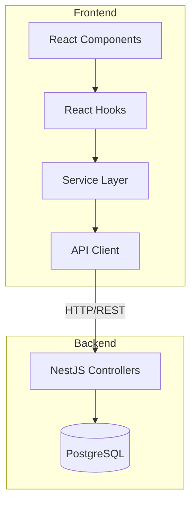
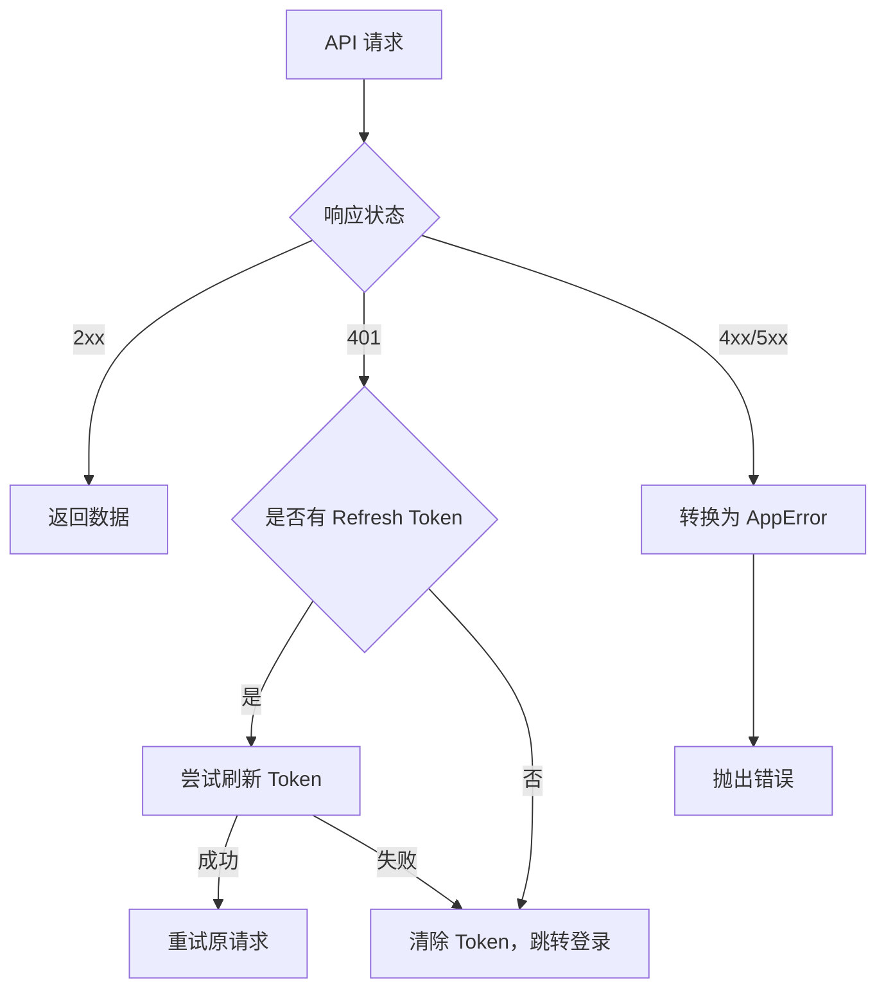

# Design Document: Frontend API Integration

## Overview

本设计文档描述了将前端应用从 localStorage 本地存储模式改为调用后端 REST API 的技术方案。主要包括 API 客户端封装、各服务模块的 API 集成、认证机制实现以及 React Hooks 的更新。

## Architecture



### 架构说明

1. **UI 层**: React 组件，负责用户界面展示
2. **Hooks 层**: React Hooks，管理状态和副作用
3. **Service 层**: 业务逻辑封装，调用 API Client
4. **API Client**: 统一的 HTTP 请求客户端，处理认证和错误

## Components and Interfaces

### 1. API Client (`src/lib/apiClient.ts`)

```typescript
interface ApiClientConfig {
  baseURL: string;
  timeout?: number;
}

interface ApiResponse<T> {
  data: T;
  message?: string;
}

interface ApiError {
  statusCode: number;
  message: string;
  error?: string;
}

class ApiClient {
  // 单例实例
  private static instance: ApiClient;
  
  // 获取实例
  static getInstance(): ApiClient;
  
  // HTTP 方法
  get<T>(url: string, params?: Record<string, any>): Promise<T>;
  post<T>(url: string, data?: any): Promise<T>;
  patch<T>(url: string, data?: any): Promise<T>;
  delete<T>(url: string): Promise<T>;
  
  // 文件上传
  upload<T>(url: string, formData: FormData, onProgress?: (progress: number) => void): Promise<T>;
  
  // 认证管理
  setTokens(accessToken: string, refreshToken: string): void;
  clearTokens(): void;
  getAccessToken(): string | null;
}
```

### 2. Auth Service (`src/services/authService.ts`)

```typescript
interface LoginRequest {
  username: string;
  password: string;
}

interface RegisterRequest {
  username: string;
  email: string;
  password: string;
}

interface AuthResponse {
  accessToken: string;
  refreshToken: string;
  user: {
    id: string;
    username: string;
    email: string;
    role: string;
  };
}

interface UserProfile {
  sub: string;
  username: string;
  role: string;
}

// API 方法
function login(data: LoginRequest): Promise<AuthResponse>;
function register(data: RegisterRequest): Promise<AuthResponse>;
function refreshToken(refreshToken: string): Promise<AuthResponse>;
function getProfile(): Promise<UserProfile>;
function logout(): void;
function isAuthenticated(): boolean;
```

### 3. Question Service (`src/services/questionService.ts`)

```typescript
interface QuestionApiResponse {
  id: string;
  title: string;
  content: RichContent;
  type: QuestionType;
  difficulty: DifficultyLevel;
  categoryId: string;
  tagIds: string[];
  options?: OptionApiResponse[];
  answer: string | string[];
  explanation?: RichContent;
  createdAt: string;
  updatedAt: string;
}

interface CreateQuestionRequest {
  title: string;
  content: string;  // 原始 HTML
  type: QuestionType;
  difficulty: DifficultyLevel;
  categoryId: string;
  tagIds?: string[];
  options?: OptionRequest[];
  answer: string | string[];
  explanation?: string;
}

interface QueryQuestionParams {
  page?: number;
  pageSize?: number;
  keyword?: string;
  categoryId?: string;
  type?: QuestionType;
  difficulty?: DifficultyLevel;
  tagIds?: string[];
}

// API 方法
function getQuestions(params: QueryQuestionParams): Promise<PaginatedResponse<Question>>;
function getQuestionById(id: string): Promise<Question>;
function createQuestion(data: CreateQuestionRequest): Promise<Question>;
function updateQuestion(id: string, data: Partial<CreateQuestionRequest>): Promise<Question>;
function deleteQuestion(id: string): Promise<void>;
```

### 4. Category Service (`src/services/categoryService.ts`)

```typescript
interface CategoryApiResponse {
  id: string;
  name: string;
  parentId: string | null;
  level: number;
  path: string;
  questionCount: number;
  createdAt: string;
  updatedAt: string;
}

interface CreateCategoryRequest {
  name: string;
  parentId?: string;
}

// API 方法
function getAllCategories(): Promise<Category[]>;
function getCategoryTree(): Promise<CategoryTreeNode[]>;
function getCategoryById(id: string): Promise<Category>;
function createCategory(data: CreateCategoryRequest): Promise<Category>;
function updateCategory(id: string, data: Partial<CreateCategoryRequest>): Promise<Category>;
function deleteCategory(id: string): Promise<void>;
```

### 5. Tag Service (`src/services/tagService.ts`)

```typescript
interface TagApiResponse {
  id: string;
  name: string;
  color: string;
  questionCount: number;
  createdAt: string;
  updatedAt: string;
}

interface CreateTagRequest {
  name: string;
  color?: string;
}

// API 方法
function getAllTags(): Promise<Tag[]>;
function getTagById(id: string): Promise<Tag>;
function createTag(data: CreateTagRequest): Promise<Tag>;
function updateTag(id: string, data: Partial<CreateTagRequest>): Promise<Tag>;
function deleteTag(id: string): Promise<void>;
```

### 6. Upload Service (`src/services/uploadService.ts`)

```typescript
interface UploadResult {
  url: string;
  filename: string;
  size: number;
}

// API 方法
function uploadImage(file: File, onProgress?: (progress: number) => void): Promise<UploadResult>;
function validateImageFile(file: File): { valid: boolean; error?: string };
```

## Data Models

### API 响应包装格式

后端所有 API 响应都遵循统一格式：

```typescript
// 成功响应
interface SuccessResponse<T> {
  data: T;
  message?: string;
}

// 分页响应
interface PaginatedApiResponse<T> {
  data: T[];
  meta: {
    total: number;
    page: number;
    pageSize: number;
    totalPages: number;
  };
}

// 错误响应
interface ErrorResponse {
  statusCode: number;
  message: string | string[];
  error: string;
}
```

### Token 存储

```typescript
const TOKEN_KEYS = {
  ACCESS_TOKEN: 'access_token',
  REFRESH_TOKEN: 'refresh_token',
} as const;
```

## Correctness Properties

*A property is a characteristic or behavior that should hold true across all valid executions of a system-essentially, a formal statement about what the system should do. Properties serve as the bridge between human-readable specifications and machine-verifiable correctness guarantees.*

### Property 1: API Client 请求行为一致性

*For any* HTTP 请求方法（GET、POST、PATCH、DELETE）和任意有效的 Token，API Client 发送的请求应该包含正确的 HTTP 方法、URL、请求体，并且在设置了 Token 的情况下，请求头应该包含 Authorization 字段。

**Validates: Requirements 1.1, 1.2**

### Property 2: 错误响应转换完整性

*For any* 后端返回的错误响应（包含 statusCode 和 message），都应该被正确转换为 AppError 格式，其中 type 字段应该根据 statusCode 正确映射，message 字段应该保留原始错误信息。

**Validates: Requirements 1.4**

### Property 3: 分页参数传递正确性

*For any* 分页查询参数（page >= 1, pageSize > 0），传递给 Question_Service 的 getQuestions 方法后，生成的 API 请求 URL 应该包含正确的 page 和 pageSize 查询参数。

**Validates: Requirements 3.1**

### Property 4: 文件验证逻辑正确性

*For any* 文件对象，validateImageFile 函数应该：
- 当文件类型不在 ['image/jpeg', 'image/png', 'image/gif', 'image/webp'] 中时返回 { valid: false }
- 当文件大小超过 5MB 时返回 { valid: false }
- 当文件类型有效且大小在限制内时返回 { valid: true }

**Validates: Requirements 6.3**

### Property 5: 认证状态一致性

*For any* 认证操作序列（登录后登出，或直接检查未登录状态），isAuthenticated() 的返回值应该与本地存储中是否存在有效 Token 保持一致。

**Validates: Requirements 2.2, 2.5**

## Error Handling

### 错误类型映射

| HTTP 状态码 | 错误类型 | 说明 |
|------------|---------|------|
| 400 | VALIDATION_ERROR | 请求参数验证失败 |
| 401 | UNAUTHORIZED | 未授权或 Token 过期 |
| 403 | FORBIDDEN | 权限不足 |
| 404 | NOT_FOUND | 资源不存在 |
| 409 | DUPLICATE_ERROR | 资源冲突（如名称重复） |
| 500 | SERVER_ERROR | 服务器内部错误 |

### 错误处理流程



## Testing Strategy

### 单元测试

- 测试 API Client 的请求方法
- 测试各 Service 的数据转换逻辑
- 测试错误处理逻辑
- 测试 Token 管理逻辑

### 属性测试

- 使用 fast-check 进行属性测试
- 测试数据转换的一致性
- 测试分页参数的正确性

### 集成测试

- 使用 MSW (Mock Service Worker) 模拟后端 API
- 测试完整的请求-响应流程
- 测试 Token 刷新机制

### 测试配置

```typescript
// vitest.config.ts
export default defineConfig({
  test: {
    // 属性测试配置
    testTimeout: 30000, // 属性测试可能需要更长时间
  },
});
```
