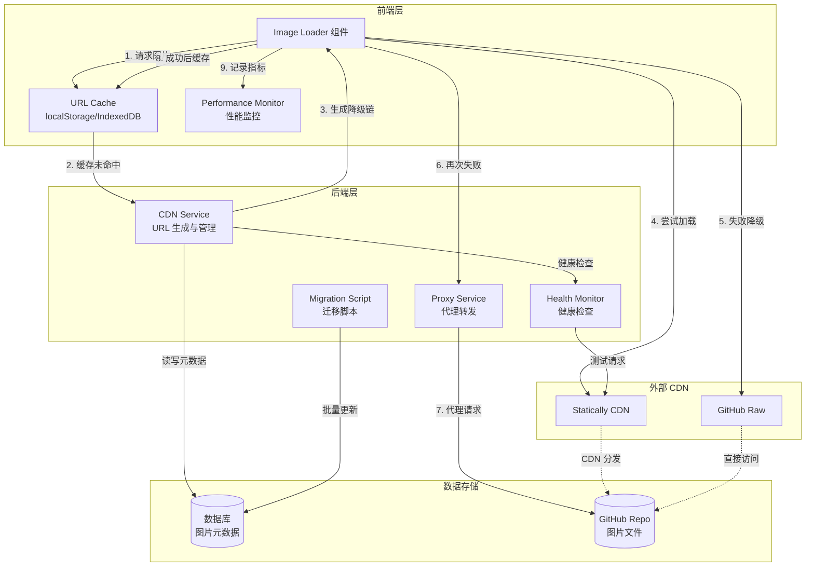

# 设计文档：图片 CDN 混合降级方案

## 概述

本设计实现了一个健壮的多 CDN 混合降级系统，解决 jsDelivr CDN 连接超时问题。系统采用三层降级策略（Statically CDN → GitHub Raw → 自建代理），确保图片始终能够加载。

核心设计原则：
- **渐进式降级**：按优先级顺序尝试 CDN，失败后自动切换
- **智能缓存**：记住成功的降级 URL，避免重复失败
- **透明重试**：前端自动处理降级，用户无感知
- **可观测性**：详细的日志和监控指标

系统分为三个主要层次：
1. **前端图片加载器**：处理图片加载、降级重试、状态展示
2. **后端 CDN 服务**：生成降级 URL、健康检查、代理服务
3. **缓存和监控**：URL 缓存、健康状态缓存、性能指标

## 架构

### 系统架构图



### 降级流程


## 组件和接口

### 1. 前端组件

#### 1.1 ImageLoader 组件

React 组件，处理图片加载、降级重试和状态展示。

```typescript
interface ImageLoaderProps {
  filename: string;           // 图片文件名
  alt?: string;              // 图片 alt 文本
  className?: string;        // CSS 类名
  fallbackUrls?: string[];   // 可选的自定义降级 URL
  timeout?: number;          // 超时阈值（毫秒），默认 5000
  onLoad?: () => void;       // 加载成功回调
  onError?: (error: Error) => void;  // 加载失败回调
  lazy?: boolean;            // 是否启用懒加载，默认 true
}

interface ImageLoaderState {
  status: 'loading' | 'loaded' | 'error';
  currentUrlIndex: number;   // 当前尝试的 URL 索引
  urls: string[];            // 降级 URL 链
  retryCount: number;        // 重试次数
}

class ImageLoader extends React.Component<ImageLoaderProps, ImageLoaderState> {
  // 组件挂载时初始化
  componentDidMount(): void;
  
  // 加载图片，带超时和降级逻辑
  loadImage(url: string, timeout: number): Promise<void>;
  
  // 尝试下一个降级 URL
  tryNextUrl(): void;
  
  // 手动重试（从第一个 URL 开始）
  retry(): void;
  
  // 渲染：加载中显示骨架屏，失败显示占位图和重试按钮
  render(): JSX.Element;
}
```

#### 1.2 URLCache 服务

管理成功 URL 的缓存，支持 localStorage 和 IndexedDB。

```typescript
interface CacheEntry {
  url: string;               // 成功的 URL
  timestamp: number;         // 缓存时间戳
  cdnType: 'statically' | 'github' | 'proxy';  // CDN 类型
}

interface URLCacheConfig {
  storage: 'localStorage' | 'indexedDB';  // 存储类型
  ttl: number;               // 缓存过期时间（毫秒），默认 24 小时
  maxEntries?: number;       // 最大缓存条目数（仅 IndexedDB）
}

class URLCache {
  constructor(config: URLCacheConfig);
  
  // 获取缓存的 URL
  get(filename: string): Promise<string | null>;
  
  // 设置缓存 URL
  set(filename: string, url: string, cdnType: string): Promise<void>;
  
  // 删除缓存条目（当 URL 失败时）
  remove(filename: string): Promise<void>;
  
  // 清理过期条目
  cleanup(): Promise<void>;
  
  // 获取缓存统计信息
  getStats(): Promise<{ size: number; hitRate: number }>;
}
```

#### 1.3 PerformanceMonitor 服务

收集和报告图片加载性能指标。

```typescript
interface LoadMetrics {
  filename: string;
  startTime: number;
  endTime: number;
  duration: number;
  cdnType: 'statically' | 'github' | 'proxy';
  success: boolean;
  failedUrls: string[];      // 失败的 URL 列表
  retryCount: number;
}

class PerformanceMonitor {
  // 记录加载开始
  startLoad(filename: string): void;
  
  // 记录加载结束
  endLoad(filename: string, success: boolean, cdnType: string, failedUrls: string[]): void;
  
  // 获取性能指标
  getMetrics(): {
    averageLoadTime: number;
    fallbackRate: number;     // 降级率（使用备用 CDN 的比例）
    cacheHitRate: number;
    successRate: number;
    cdnPerformance: {         // 各 CDN 的性能
      statically: { avgTime: number; successRate: number };
      github: { avgTime: number; successRate: number };
      proxy: { avgTime: number; successRate: number };
    };
  };
  
  // 导出指标（用于监控系统）
  exportMetrics(): string;
}
```

### 2. 后端服务

#### 2.1 CDNService 类

核心服务，生成降级 URL、管理配置、协调健康检查。

```typescript
interface CDNConfig {
  githubRepo: string;        // GitHub 仓库（owner/repo）
  githubBranch: string;      // 分支名，默认 'main'
  imagePath: string;         // 图片路径前缀
  timeout: number;           // 超时阈值（毫秒）
  priority: string[];        // CDN 优先级 ['statically', 'github', 'proxy']
  enabledCDNs: {             // 启用的 CDN
    statically: boolean;
    github: boolean;
    proxy: boolean;
  };
  cacheTTL: number;          // URL 缓存过期时间（毫秒）
}

interface FallbackURLs {
  filename: string;
  urls: string[];            // 降级 URL 数组
  primary: string;           // 主 URL（向后兼容）
}

class CDNService {
  constructor(config: CDNConfig);
  
  // 生成所有降级 URL
  generateFallbackURLs(filename: string): FallbackURLs;
  
  // 生成 Statically CDN URL
  generateStaticallyURL(filename: string): string;
  
  // 生成 GitHub Raw URL
  generateGitHubRawURL(filename: string): string;
  
  // 生成代理服务 URL
  generateProxyURL(filename: string): string;
  
  // 获取健康状态（委托给 HealthMonitor）
  getHealthStatus(): Promise<HealthStatus>;
  
  // 从环境变量加载配置
  static loadConfig(): CDNConfig;
}
```

#### 2.2 HealthMonitor 类

监控 CDN 健康状态，缓存检查结果。

```typescript
interface HealthStatus {
  healthy: boolean;
  cdnType: 'statically' | 'github' | 'proxy';
  lastCheck: number;         // 最后检查时间戳
  responseTime?: number;     // 响应时间（毫秒）
  error?: string;            // 错误信息
}

interface HealthCheckConfig {
  testImageFilename: string; // 测试图片文件名
  timeout: number;           // 超时阈值
  cacheInterval: number;     // 缓存间隔（毫秒），默认 60 秒
}

class HealthMonitor {
  constructor(cdnService: CDNService, config: HealthCheckConfig);
  
  // 检查 CDN 健康状态（带缓存）
  checkHealth(cdnType: 'statically' | 'github' | 'proxy'): Promise<HealthStatus>;
  
  // 执行实际的健康检查（无缓存）
  private performHealthCheck(url: string, cdnType: string): Promise<HealthStatus>;
  
  // 清除缓存
  clearCache(): void;
  
  // 获取所有 CDN 的健康状态
  getAllHealthStatus(): Promise<Record<string, HealthStatus>>;
}
```

#### 2.3 ProxyService 类

代理服务，从 GitHub 获取图片并返回，带缓存和压缩。

```typescript
interface ProxyConfig {
  cacheTTL: number;          // 缓存时间（秒），默认 3600
  enableCompression: boolean; // 是否启用压缩
  maxCacheSize: number;      // 最大缓存大小（字节）
}

interface ProxyRequest {
  filename: string;
  width?: number;            // 可选的宽度（用于压缩）
  height?: number;           // 可选的高度
  quality?: number;          // 图片质量（1-100）
}

class ProxyService {
  constructor(cdnService: CDNService, config: ProxyConfig);
  
  // 代理图片请求
  async proxyImage(req: ProxyRequest): Promise<{
    data: Buffer;
    contentType: string;
    cacheControl: string;
    etag: string;
  }>;
  
  // 从 GitHub 获取图片
  private async fetchFromGitHub(filename: string): Promise<Buffer>;
  
  // 压缩图片
  private async compressImage(
    buffer: Buffer,
    width?: number,
    height?: number,
    quality?: number
  ): Promise<Buffer>;
  
  // 生成 ETag
  private generateETag(buffer: Buffer): string;
}
```

#### 2.4 MigrationScript 类

迁移脚本，批量更新数据库中的 jsDelivr URL 为 Statically URL。

```typescript
interface MigrationConfig {
  databaseUrl: string;       // 数据库连接字符串
  tableName: string;         // 表名
  urlColumn: string;         // URL 列名
  batchSize: number;         // 批处理大小，默认 100
  dryRun: boolean;           // 是否为试运行（不实际更新）
}

interface MigrationResult {
  totalRecords: number;      // 总记录数
  updatedRecords: number;    // 更新的记录数
  failedRecords: number;     // 失败的记录数
  skippedRecords: number;    // 跳过的记录数（已经是 Statically）
  errors: Array<{
    recordId: string;
    error: string;
  }>;
}

class MigrationScript {
  constructor(config: MigrationConfig);
  
  // 执行迁移
  async migrate(): Promise<MigrationResult>;
  
  // 转换单个 URL
  private convertURL(jsDelivrURL: string): string;
  
  // 验证 URL 格式
  private isJsDelivrURL(url: string): boolean;
  private isStaticallyURL(url: string): boolean;
  
  // 回滚迁移
  async rollback(): Promise<MigrationResult>;
  
  // 生成迁移报告
  generateReport(result: MigrationResult): string;
}
```

### 3. API 接口

#### 3.1 图片上传接口（增强）

```typescript
// POST /api/upload
interface UploadRequest {
  file: File;                // 图片文件
  metadata?: {               // 可选元数据
    title?: string;
    description?: string;
  };
}

interface UploadResponse {
  success: boolean;
  filename: string;          // 文件名
  url: string;               // 主 URL（Statically，向后兼容）
  urls: {                    // 所有降级 URL
    statically: string;
    github: string;
    proxy: string;
  };
  size: number;              // 文件大小（字节）
  uploadedAt: string;        // 上传时间（ISO 8601）
}
```

#### 3.2 代理接口

```typescript
// GET /api/upload/proxy/:filename
// Query 参数：
//   - width: 可选，图片宽度
//   - height: 可选，图片高度
//   - quality: 可选，图片质量（1-100）

// 响应头：
//   - Content-Type: image/jpeg | image/png | image/webp
//   - Cache-Control: public, max-age=3600
//   - ETag: <hash>

// 响应体：图片二进制数据
```

#### 3.3 健康检查接口

```typescript
// GET /api/health/cdn
interface HealthCheckResponse {
  statically: HealthStatus;
  github: HealthStatus;
  proxy: HealthStatus;
  overall: 'healthy' | 'degraded' | 'unhealthy';
}

// GET /api/health/cdn/:cdnType
// 返回单个 CDN 的健康状态
```

#### 3.4 性能指标接口

```typescript
// GET /api/metrics/cdn
interface MetricsResponse {
  averageLoadTime: number;
  fallbackRate: number;
  cacheHitRate: number;
  successRate: number;
  cdnPerformance: {
    statically: { avgTime: number; successRate: number };
    github: { avgTime: number; successRate: number };
    proxy: { avgTime: number; successRate: number };
  };
  period: string;            // 统计周期（如 '24h'）
}
```

## 数据模型

### 1. URL 缓存条目（前端）

```typescript
// localStorage key: `cdn_cache_${filename}`
interface CacheEntry {
  url: string;               // 成功的 URL
  timestamp: number;         // 缓存时间戳（毫秒）
  cdnType: 'statically' | 'github' | 'proxy';
  hits: number;              // 缓存命中次数
}
```

### 2. 健康检查缓存（后端）

```typescript
// 内存缓存，60 秒过期
interface HealthCache {
  [cdnType: string]: {
    status: HealthStatus;
    expiresAt: number;       // 过期时间戳
  };
}
```

### 3. 图片元数据（数据库）

```typescript
// 数据库表：images
interface ImageRecord {
  id: string;                // 主键
  filename: string;          // 文件名（唯一）
  url: string;               // 主 URL（Statically）
  githubUrl: string;         // GitHub Raw URL
  proxyUrl: string;          // 代理 URL
  size: number;              // 文件大小（字节）
  contentType: string;       // MIME 类型
  uploadedAt: Date;          // 上传时间
  updatedAt: Date;           // 更新时间
}
```

### 4. 性能指标（内存/数据库）

```typescript
// 内存中的指标收集
interface PerformanceMetrics {
  loads: LoadMetrics[];      // 加载记录
  aggregated: {              // 聚合指标
    totalLoads: number;
    successfulLoads: number;
    failedLoads: number;
    totalDuration: number;
    fallbackCount: number;
    cacheHits: number;
    cacheMisses: number;
  };
}
```

## 正确性属性


属性是一种特征或行为，应该在系统的所有有效执行中保持为真——本质上是关于系统应该做什么的形式化陈述。属性作为人类可读规范和机器可验证正确性保证之间的桥梁。

### 属性反思

在分析了所有验收标准后，我识别出以下冗余和合并机会：

**冗余属性**：
- 1.5 和 3.1 都测试"成功加载后缓存 URL"——合并为一个属性
- 1.4 和 5.2 都测试"生成降级 URL"——合并为一个属性
- 1.6 和 8.2 都测试"配置 CDN 优先级"——合并为一个属性
- 2.2 和 7.1 都测试"加载时显示加载指示器"——合并为一个属性
- 1.3、2.3、7.3、7.4 都测试"所有 URL 失败时显示错误状态"——合并为一个示例
- 5.4 和 10.4 都测试"代理服务设置缓存头"——合并为一个属性
- 6.5 和 10.7 都测试"提供性能指标"——合并为一个属性

**合并后的核心属性**：
1. 降级链生成和顺序
2. 降级重试机制
3. URL 缓存管理（设置、获取、失效、过期）
4. 健康检查和缓存
5. 代理服务功能
6. 错误处理和日志
7. 配置管理
8. 迁移功能
9. 性能优化

### 核心属性

**属性 1：降级链生成完整性**

*对于任何*图片文件名，CDN 服务生成的降级链应包含三个有效的 URL（Statically、GitHub Raw、Proxy），且每个 URL 都应包含正确的文件名。

**验证需求：1.4, 5.2**

---

**属性 2：降级链顺序可配置**

*对于任何*有效的 CDN 优先级配置（如 ['github', 'statically', 'proxy']），生成的降级链顺序应与配置的顺序完全一致。

**验证需求：1.6, 8.2**

---

**属性 3：自动降级重试**

*对于任何*图片和降级链，当当前 URL 加载失败或超时时，图片加载器应自动尝试降级链中的下一个 URL，直到成功或耗尽所有 URL。

**验证需求：1.1, 1.2, 2.1**

---

**属性 4：成功 URL 缓存**

*对于任何*图片，当从降级 URL（非主 CDN）成功加载后，该 URL 应被缓存，且下次请求同一图片时应优先使用缓存的 URL。

**验证需求：1.5, 3.1, 3.2**

---

**属性 5：缓存持久化**

*对于任何*成功缓存的 URL，该缓存条目应持久化到配置的存储（localStorage 或 IndexedDB）中，且包含文件名、URL、CDN 类型和时间戳。

**验证需求：3.3, 10.5**

---

**属性 6：缓存失效和重试**

*对于任何*缓存的 URL，当该 URL 加载失败时，缓存条目应被移除，且系统应从头开始重试完整的降级链。

**验证需求：3.4**

---

**属性 7：缓存过期**

*对于任何*缓存条目，当其时间戳超过配置的 TTL（默认 24 小时）时，该条目应被视为过期，系统应重新从主 CDN 开始尝试。

**验证需求：3.5, 8.4**

---

**属性 8：健康检查响应**

*对于任何*CDN 类型（statically、github、proxy），健康检查应尝试加载测试图片，并根据结果返回健康状态（成功时返回 healthy，失败时返回 unhealthy 及错误信息）。

**验证需求：4.2, 4.3, 4.4**

---

**属性 9：健康检查缓存**

*对于任何*CDN 健康检查，结果应被缓存配置的时间（默认 60 秒），在缓存期内的重复检查应直接返回缓存结果而不重新执行检查。

**验证需求：4.5, 8.5**

---

**属性 10：上传响应完整性**

*对于任何*成功上传的图片，响应应包含文件名、主 URL（url 字段，Statically）、所有降级 URL（urls 对象，包含 statically、github、proxy）、文件大小和上传时间。

**验证需求：5.1, 5.6, 5.7**

---

**属性 11：代理服务缓存头**

*对于任何*通过代理服务请求的图片，响应应包含适当的 HTTP 缓存头（Cache-Control 和 ETag），且 Cache-Control 的 max-age 应等于配置的缓存 TTL。

**验证需求：5.4, 8.6, 10.4**

---

**属性 12：错误类型区分**

*对于任何*图片加载失败，系统应正确区分错误类型（网络错误、超时错误、HTTP 错误），并在日志中记录相应的错误类型、URL 和时间戳。

**验证需求：6.1, 6.3**

---

**属性 13：降级失败日志**

*对于任何*图片，当所有降级 URL 都失败时，系统应记录一个严重错误，包含所有尝试的 URL 和各自的失败原因。

**验证需求：6.2**

---

**属性 14：降级成功警告**

*对于任何*图片，当主 CDN 失败但降级 URL 成功加载时，系统应记录一个警告，包含失败的主 URL 和成功的降级 URL。

**验证需求：6.4**

---

**属性 15：性能指标收集**

*对于任何*图片加载操作，系统应收集并聚合性能指标，包括平均加载时间、降级率、缓存命中率、成功率，以及各 CDN 的性能统计。

**验证需求：6.5, 10.7**

---

**属性 16：加载状态展示**

*对于任何*图片加载器实例，其状态应准确反映当前加载阶段：加载中时显示加载指示器，加载成功时显示图片，所有 URL 失败时显示错误状态和重试按钮。

**验证需求：2.2, 7.1, 7.2**

---

**属性 17：重试从头开始**

*对于任何*处于错误状态的图片加载器，当用户触发重试时，系统应重置状态并从降级链的第一个 URL（主 CDN）重新开始加载。

**验证需求：2.4**

---

**属性 18：状态平滑过渡**

*对于任何*图片加载器，当图片加载成功时（包括重试后成功），状态应从 'loading' 平滑过渡到 'loaded'。

**验证需求：7.5**

---

**属性 19：超时阈值配置**

*对于任何*有效的超时配置值（以毫秒为单位），CDN 服务应使用该值作为图片加载的超时阈值，默认值应为 5000 毫秒。

**验证需求：8.1**

---

**属性 20：CDN 启用/禁用配置**

*对于任何*CDN 类型，当其被配置为禁用时，生成的降级链应不包含该 CDN 的 URL。

**验证需求：8.3**

---

**属性 21：自定义 URL 附加**

*对于任何*提供的自定义降级 URL 列表，这些 URL 应被附加到标准降级链的末尾，保持原有顺序。

**验证需求：8.7**

---

**属性 22：URL 格式识别**

*对于任何*jsDelivr 或 Statically 格式的 URL，系统应能正确识别其格式类型。

**验证需求：9.2**

---

**属性 23：jsDelivr URL 自动转换**

*对于任何*jsDelivr 格式的 URL，图片加载器应自动将其转换为对应的 Statically URL。

**验证需求：9.3**

---

**属性 24：迁移日志记录**

*对于任何*迁移操作，系统应记录详细日志，包括总记录数、成功更新数、失败数、跳过数，以及每个失败记录的 ID 和错误信息。

**验证需求：9.4**

---

**属性 25：迁移往返一致性**

*对于任何*数据库状态，执行迁移（jsDelivr → Statically）然后回滚（Statically → jsDelivr）应恢复到原始状态。

**验证需求：9.5**

---

**属性 26：迁移验证报告**

*对于任何*完成的迁移，系统应生成验证报告，包含更新的记录数、成功率和失败详情。

**验证需求：9.6**

---

**属性 27：懒加载行为**

*对于任何*启用懒加载的图片加载器，图片应仅在进入视口时才开始加载，视口外的图片不应触发加载请求。

**验证需求：10.2**

---

**属性 28：图片压缩参数**

*对于任何*代理服务请求，当提供宽度、高度或质量参数时，返回的图片应根据这些参数进行压缩，且文件大小应小于或等于原始图片。

**验证需求：10.3**

---

**属性 29：缓存 URL 跳过健康检查**

*对于任何*从缓存 URL 加载的图片，系统应直接使用缓存的 URL，不应执行健康检查。

**验证需求：10.6**

---

### 示例测试用例

以下是需要具体示例测试的场景：

**示例 1：所有 URL 失败显示错误状态**

给定一个图片文件名，当所有降级 URL（Statically、GitHub、Proxy）都返回失败时，图片加载器应显示错误状态，包含占位图片、错误图标和重试按钮。

**验证需求：1.3, 2.3, 7.3, 7.4**

---

**示例 2：健康检查端点存在**

系统应提供 GET /api/health/cdn 端点，返回所有 CDN 的健康状态。

**验证需求：4.1**

---

**示例 3：代理服务端点功能**

系统应提供 GET /api/upload/proxy/:filename 端点，能够从 GitHub 获取图片并返回，处理 GitHub API 限流错误。

**验证需求：5.3, 5.5**

---

**示例 4：迁移脚本功能**

系统应提供迁移脚本，能够批量更新数据库中的 jsDelivr URL 为 Statically URL，支持试运行模式。

**验证需求：9.1**

---

**示例 5：预加载机制**

图片加载器应实现预加载机制，在可见区域的图片加载完成后，提前加载即将进入视口的图片。

**验证需求：10.1**

---

## 错误处理

### 1. 网络错误处理

**超时错误**：
- 每个 URL 加载设置超时阈值（默认 5 秒）
- 超时后立即尝试下一个降级 URL
- 记录超时错误和 URL

**连接错误**：
- 捕获网络连接失败（ERR_CONNECTION_REFUSED, ERR_CONNECTION_TIMED_OUT）
- 立即降级到下一个 URL，不等待超时
- 记录连接错误类型

**HTTP 错误**：
- 4xx 错误：记录错误但不降级（文件不存在）
- 5xx 错误：降级到下一个 URL（服务器错误）
- 记录 HTTP 状态码和响应信息

### 2. 缓存错误处理

**缓存读取失败**：
- 捕获 localStorage/IndexedDB 读取错误
- 降级到不使用缓存，直接从主 CDN 加载
- 记录缓存错误但不影响图片加载

**缓存写入失败**：
- 捕获存储空间不足或权限错误
- 继续正常加载图片，只是不缓存
- 记录缓存写入失败

**缓存数据损坏**：
- 验证缓存条目的数据结构
- 发现损坏时清除该条目
- 重新从主 CDN 加载

### 3. 代理服务错误处理

**GitHub API 限流**：
- 检测 403 Forbidden 和 X-RateLimit-Remaining 头
- 返回 429 Too Many Requests 状态码
- 响应体包含重试时间和错误信息
- 前端显示友好的限流提示

**GitHub 文件不存在**：
- 返回 404 Not Found
- 前端不再尝试其他降级 URL（文件确实不存在）
- 显示文件不存在的错误信息

**代理服务内部错误**：
- 捕获所有未预期的错误
- 返回 500 Internal Server Error
- 记录详细的错误堆栈
- 前端显示通用错误信息

### 4. 迁移错误处理

**数据库连接失败**：
- 在迁移开始前测试数据库连接
- 连接失败时立即终止，不执行任何更新
- 返回详细的连接错误信息

**URL 转换失败**：
- 验证 URL 格式是否为有效的 jsDelivr URL
- 转换失败时跳过该记录，记录到失败列表
- 继续处理其他记录

**批量更新失败**：
- 使用事务确保批次的原子性
- 批次失败时回滚该批次的所有更新
- 记录失败的批次和错误信息
- 继续处理下一个批次

### 5. 配置错误处理

**无效配置值**：
- 验证所有配置值的类型和范围
- 无效值时使用默认值并记录警告
- 不因配置错误而导致服务不可用

**缺失必需配置**：
- 检查必需的环境变量（如 GITHUB_REPO）
- 缺失时抛出启动错误，拒绝启动服务
- 提供清晰的错误信息和配置示例

### 6. 错误日志格式

所有错误日志应包含以下信息：

```typescript
interface ErrorLog {
  timestamp: string;         // ISO 8601 格式
  level: 'error' | 'warn' | 'info';
  component: string;         // 组件名（ImageLoader, CDNService, etc.）
  operation: string;         // 操作名（loadImage, generateURLs, etc.）
  filename?: string;         // 相关的图片文件名
  url?: string;              // 相关的 URL
  errorType: string;         // 错误类型（timeout, network, http, etc.）
  errorMessage: string;      // 错误信息
  errorStack?: string;       // 错误堆栈（仅服务端）
  metadata?: Record<string, any>;  // 额外的上下文信息
}
```

## 测试策略

### 1. 测试方法

本系统采用**双重测试方法**：

- **单元测试**：验证特定示例、边缘情况和错误条件
- **属性测试**：验证跨所有输入的通用属性

两者是互补的，都是全面覆盖所必需的。单元测试捕获具体的错误，属性测试验证一般正确性。

### 2. 单元测试策略

单元测试应专注于：

**具体示例**：
- 测试特定的文件名和 URL 组合
- 验证已知的边缘情况（空文件名、特殊字符）
- 测试特定的错误场景（404、500、超时）

**组件集成点**：
- 测试 ImageLoader 与 URLCache 的交互
- 测试 CDNService 与 HealthMonitor 的交互
- 测试 ProxyService 与 GitHub API 的交互

**边缘情况和错误条件**：
- 空输入、null 值、undefined
- 超长文件名、特殊字符、Unicode
- 网络错误、超时、HTTP 错误
- 缓存满、存储权限错误
- GitHub API 限流

**避免过多单元测试**：
- 不要为每个可能的输入组合编写单元测试
- 属性测试已经通过随机化处理了大量输入
- 单元测试应该简洁且有针对性

### 3. 属性测试策略

**属性测试库**：
- **前端（TypeScript/JavaScript）**：使用 `fast-check` 库
- **后端（Node.js）**：使用 `fast-check` 库

**测试配置**：
- 每个属性测试最少运行 100 次迭代
- 使用种子值确保可重现性
- 超时设置为 30 秒（考虑网络请求）

**属性测试标签格式**：

每个属性测试必须用注释标记，引用设计文档中的属性：

```typescript
// Feature: image-cdn-fallback, Property 1: 降级链生成完整性
test('generateFallbackURLs returns complete chain', () => {
  fc.assert(
    fc.property(fc.string(), (filename) => {
      const result = cdnService.generateFallbackURLs(filename);
      expect(result.urls).toHaveLength(3);
      expect(result.urls[0]).toContain('statically');
      expect(result.urls[1]).toContain('raw.githubusercontent');
      expect(result.urls[2]).toContain('/api/upload/proxy/');
    }),
    { numRuns: 100 }
  );
});
```

### 4. 测试覆盖目标

**代码覆盖率**：
- 行覆盖率：≥ 80%
- 分支覆盖率：≥ 75%
- 函数覆盖率：≥ 85%

**属性覆盖率**：
- 所有 29 个核心属性必须有对应的属性测试
- 所有 5 个示例测试用例必须有对应的单元测试

**错误场景覆盖**：
- 所有错误处理路径必须被测试
- 所有降级场景必须被测试
- 所有配置组合必须被测试

### 5. 测试数据生成

**属性测试生成器**：

```typescript
// 文件名生成器
const filenameArb = fc.string({ minLength: 1, maxLength: 100 })
  .filter(s => !s.includes('/') && !s.includes('\\'));

// URL 生成器
const urlArb = fc.oneof(
  fc.constant('https://cdn.statically.io/gh/user/repo@main/image.jpg'),
  fc.constant('https://raw.githubusercontent.com/user/repo/main/image.jpg'),
  fc.constant('http://localhost:3000/api/upload/proxy/image.jpg')
);

// CDN 配置生成器
const cdnConfigArb = fc.record({
  timeout: fc.integer({ min: 1000, max: 30000 }),
  priority: fc.shuffledSubarray(['statically', 'github', 'proxy'], { minLength: 1 }),
  enabledCDNs: fc.record({
    statically: fc.boolean(),
    github: fc.boolean(),
    proxy: fc.boolean()
  }).filter(config => Object.values(config).some(v => v)) // 至少一个启用
});

// 缓存条目生成器
const cacheEntryArb = fc.record({
  url: urlArb,
  timestamp: fc.integer({ min: 0, max: Date.now() }),
  cdnType: fc.oneof(
    fc.constant('statically'),
    fc.constant('github'),
    fc.constant('proxy')
  )
});
```

### 6. 集成测试

**端到端流程测试**：
- 测试完整的图片上传 → 生成 URL → 前端加载 → 降级 → 缓存流程
- 使用真实的 HTTP 服务器和模拟的 CDN 响应
- 验证所有组件的协同工作

**性能测试**：
- 测试并发加载多个图片的性能
- 测试缓存命中率和降级率
- 测试代理服务的吞吐量

**迁移测试**：
- 使用测试数据库执行完整的迁移流程
- 验证迁移前后的数据一致性
- 测试回滚功能

### 7. 模拟和存根

**CDN 响应模拟**：
- 使用 `nock` 或 `msw` 模拟 CDN 响应
- 模拟成功、失败、超时、限流等场景
- 确保测试的确定性和速度

**时间模拟**：
- 使用 `jest.useFakeTimers()` 模拟时间流逝
- 测试缓存过期、健康检查间隔等时间相关逻辑

**存储模拟**：
- 模拟 localStorage 和 IndexedDB
- 测试存储失败、空间不足等场景

### 8. 持续集成

**CI 流程**：
1. 运行所有单元测试和属性测试
2. 生成代码覆盖率报告
3. 运行集成测试
4. 运行性能基准测试
5. 检查测试覆盖率是否达标

**测试环境**：
- 使用 Docker 容器确保环境一致性
- 模拟不同的网络条件（慢速、不稳定）
- 测试不同的浏览器和 Node.js 版本

