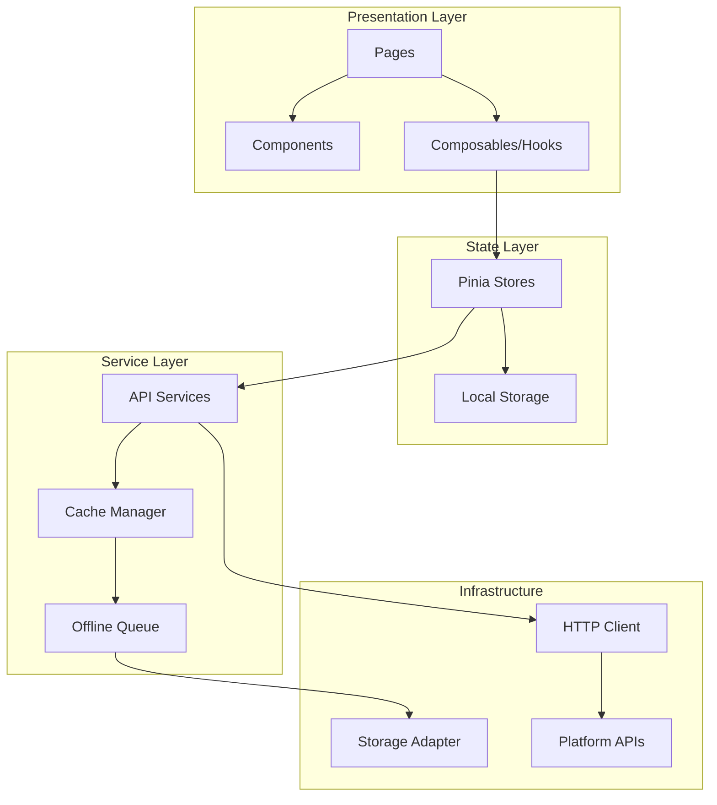

# Design Document

## Overview

本设计文档描述刷题小程序（question-miniapp）的全面重构方案。采用 uni-app x 4.x + Vue 3.4+ + TypeScript 5.x 技术栈，参考粉笔、猿题库等优秀刷题应用的设计理念，打造一款功能完善、UI 精美、体验流畅的跨端刷题应用。

### 设计目标

1. **现代化架构** - 模块化、可维护、可扩展
2. **优秀体验** - 流畅动画、即时反馈、沉浸式答题
3. **精美UI** - 参考顶级刷题APP，打造专业视觉效果
4. **跨端一致** - 微信小程序、H5、App 体验统一

## Architecture

### 整体架构图



### 目录结构

```
question-miniapp/
├── src/
│   ├── api/                    # API 接口层
│   │   ├── auth.ts
│   │   ├── question.ts
│   │   ├── category.ts
│   │   ├── statistics.ts
│   │   └── index.ts
│   │
│   ├── components/             # 可复用组件
│   │   ├── common/             # 通用组件
│   │   │   ├── ProgressRing.vue
│   │   │   ├── SkeletonLoader.vue
│   │   │   ├── EmptyState.vue
│   │   │   ├── PullRefresh.vue
│   │   │   └── VirtualList.vue
│   │   │
│   │   ├── question/           # 题目相关组件
│   │   │   ├── QuestionCard.vue
│   │   │   ├── OptionItem.vue
│   │   │   ├── AnswerFeedback.vue
│   │   │   ├── QuestionNavigator.vue
│   │   │   └── RichContent.vue
│   │   │
│   │   ├── statistics/         # 统计相关组件
│   │   │   ├── StudyCalendar.vue
│   │   │   ├── LineChart.vue
│   │   │   ├── PieChart.vue
│   │   │   └── CategoryAccuracy.vue
│   │   │
│   │   └── layout/             # 布局组件
│   │       ├── TabBar.vue
│   │       ├── NavBar.vue
│   │       └── SafeArea.vue
│   │
│   ├── composables/            # 组合式函数
│   │   ├── useStudySession.ts
│   │   ├── useQuestion.ts
│   │   ├── useStatistics.ts
│   │   ├── useOffline.ts
│   │   └── useTheme.ts
│   │
│   ├── pages/                  # 页面
│   │   ├── index/              # 首页
│   │   ├── study/              # 刷题页
│   │   ├── category/           # 分类页
│   │   ├── wrong-book/         # 错题本
│   │   ├── favorites/          # 收藏
│   │   ├── statistics/         # 统计
│   │   ├── profile/            # 个人中心
│   │   └── login/              # 登录
│   │
│   ├── stores/                 # Pinia 状态管理
│   │   ├── user.ts
│   │   ├── study.ts
│   │   ├── wrongBook.ts
│   │   ├── favorites.ts
│   │   ├── statistics.ts
│   │   └── settings.ts
│   │
│   ├── styles/                 # 样式
│   │   ├── variables.scss
│   │   ├── mixins.scss
│   │   ├── animations.scss
│   │   └── theme.scss
│   │
│   ├── types/                  # TypeScript 类型
│   │   ├── question.ts
│   │   ├── user.ts
│   │   ├── statistics.ts
│   │   └── index.ts
│   │
│   └── utils/                  # 工具函数
│       ├── request.ts
│       ├── storage.ts
│       ├── cache.ts
│       ├── offline.ts
│       └── platform.ts
```

## Components and Interfaces

### 核心组件设计

#### 1. ProgressRing 环形进度条

```typescript
// components/common/ProgressRing.vue
interface ProgressRingProps {
  progress: number        // 0-100 进度值
  size: number           // 组件尺寸 (rpx)
  strokeWidth: number    // 线条宽度 (rpx)
  color: string          // 进度条颜色
  bgColor: string        // 背景色
  showText: boolean      // 是否显示中心文字
  animated: boolean      // 是否启用动画
}

interface ProgressRingSlots {
  default: () => VNode   // 中心内容插槽
}
```

#### 2. QuestionCard 题目卡片

```typescript
// components/question/QuestionCard.vue
interface QuestionCardProps {
  question: Question
  showAnswer: boolean
  userAnswer: string | string[]
  disabled: boolean
}

interface QuestionCardEmits {
  (e: 'select', optionId: string): void
  (e: 'input', value: string): void
  (e: 'submit'): void
  (e: 'bookmark'): void
}
```

#### 3. QuestionNavigator 题目导航器

```typescript
// components/question/QuestionNavigator.vue
interface QuestionNavigatorProps {
  questions: Question[]
  currentIndex: number
  answerRecords: Map<string, AnswerRecord>
}

interface QuestionNavigatorEmits {
  (e: 'navigate', index: number): void
  (e: 'close'): void
}
```

#### 4. StudyCalendar 学习日历

```typescript
// components/statistics/StudyCalendar.vue
interface StudyCalendarProps {
  studyDays: Date[]      // 有学习记录的日期
  currentStreak: number  // 当前连续天数
  longestStreak: number  // 最长连续天数
}
```

### API 接口设计

#### Question API

```typescript
// api/question.ts
interface QuestionAPI {
  // 获取题目列表
  getList(params: QuestionListParams): Promise<PaginatedResponse<Question>>
  
  // 获取随机题目
  getRandom(params: RandomQuestionParams): Promise<Question[]>
  
  // 获取单个题目详情
  getDetail(id: string): Promise<Question>
  
  // 提交答案
  submitAnswer(questionId: string, answer: AnswerSubmission): Promise<AnswerResult>
  
  // 批量提交答案（离线同步用）
  batchSubmitAnswers(answers: AnswerSubmission[]): Promise<BatchAnswerResult>
}

interface QuestionListParams {
  page: number
  pageSize: number
  categoryId?: string
  difficulty?: DifficultyLevel
  type?: QuestionType
  status?: 'all' | 'unanswered' | 'answered' | 'wrong'
  sort?: 'newest' | 'difficulty' | 'random'
}

interface RandomQuestionParams {
  count: number
  categoryId?: string
  difficulty?: DifficultyLevel
  excludeIds?: string[]
}
```

#### Statistics API

```typescript
// api/statistics.ts
interface StatisticsAPI {
  // 获取总体统计
  getOverview(): Promise<StudyOverview>
  
  // 获取每日统计
  getDailyStats(startDate: string, endDate: string): Promise<DailyStats[]>
  
  // 获取分类统计
  getCategoryStats(): Promise<CategoryStats[]>
  
  // 获取学习日历数据
  getStudyCalendar(year: number, month: number): Promise<StudyCalendarData>
}
```

### Store 设计

#### Study Store

```typescript
// stores/study.ts
interface StudyState {
  // 当前学习会话
  session: StudySession | null
  
  // 题目列表
  questions: Question[]
  
  // 当前题目索引
  currentIndex: number
  
  // 答题记录
  answerRecords: Map<string, AnswerRecord>
  
  // 是否显示答案
  showAnswer: boolean
  
  // 会话统计
  sessionStats: SessionStats
}

interface StudyActions {
  // 开始学习会话
  startSession(questions: Question[], mode: StudyMode): void
  
  // 提交答案
  submitAnswer(answer: string | string[]): AnswerResult
  
  // 导航到指定题目
  goToQuestion(index: number): void
  
  // 下一题
  nextQuestion(): void
  
  // 上一题
  prevQuestion(): void
  
  // 结束会话
  endSession(): SessionSummary
  
  // 重置状态
  reset(): void
}

interface StudyGetters {
  currentQuestion: Question | null
  totalCount: number
  answeredCount: number
  correctCount: number
  accuracy: number
  progress: number
  isComplete: boolean
}
```

#### Wrong Book Store

```typescript
// stores/wrongBook.ts
interface WrongBookState {
  // 错题列表
  wrongQuestions: WrongQuestion[]
  
  // 按分类分组
  groupedByCategory: Map<string, WrongQuestion[]>
  
  // 加载状态
  loading: boolean
}

interface WrongQuestion {
  question: Question
  wrongCount: number
  lastWrongDate: Date
  isMastered: boolean
  categoryId: string
  categoryName: string
}

interface WrongBookActions {
  // 添加错题
  addWrongQuestion(question: Question): void
  
  // 标记为已掌握
  markAsMastered(questionId: string): void
  
  // 批量删除已掌握
  clearMastered(): void
  
  // 获取复习题目
  getReviewQuestions(count: number): Question[]
  
  // 同步到服务器
  syncToServer(): Promise<void>
}
```

## Data Models

### 核心数据模型

```typescript
// types/question.ts

// 题目类型
type QuestionType = 
  | 'single_choice'    // 单选题
  | 'multiple_choice'  // 多选题
  | 'true_false'       // 判断题
  | 'fill_blank'       // 填空题
  | 'short_answer'     // 简答题

// 难度级别
type DifficultyLevel = 'easy' | 'medium' | 'hard'

// 富文本内容
interface RichContent {
  raw: string           // 原始内容（Markdown/HTML）
  rendered?: string     // 渲染后的 HTML
  hasLatex?: boolean    // 是否包含 LaTeX 公式
  hasImage?: boolean    // 是否包含图片
}

// 选项
interface QuestionOption {
  id: string
  content: RichContent
  isCorrect: boolean
  order: number
}

// 题目
interface Question {
  id: string
  title: string
  content: RichContent
  type: QuestionType
  difficulty: DifficultyLevel
  options?: QuestionOption[]
  answer: string | string[]
  explanation?: RichContent
  categoryId: string
  categoryName?: string
  tags?: Tag[]
  createdAt: string
  updatedAt: string
}

// 答题记录
interface AnswerRecord {
  questionId: string
  userAnswer: string | string[]
  isCorrect: boolean
  answeredAt: Date
  timeSpent: number  // 答题耗时（秒）
}

// 学习会话
interface StudySession {
  id: string
  mode: StudyMode
  startedAt: Date
  endedAt?: Date
  questionIds: string[]
  answerRecords: AnswerRecord[]
}

type StudyMode = 
  | 'random'      // 随机刷题
  | 'category'    // 分类刷题
  | 'difficulty'  // 按难度刷题
  | 'wrong_book'  // 错题复习
  | 'favorites'   // 收藏复习
```

### 统计数据模型

```typescript
// types/statistics.ts

// 总体统计
interface StudyOverview {
  totalQuestions: number
  answeredQuestions: number
  correctCount: number
  wrongCount: number
  accuracy: number
  totalStudyTime: number  // 分钟
  currentStreak: number
  longestStreak: number
}

// 每日统计
interface DailyStats {
  date: string
  answeredCount: number
  correctCount: number
  studyTime: number
  accuracy: number
}

// 分类统计
interface CategoryStats {
  categoryId: string
  categoryName: string
  totalQuestions: number
  answeredCount: number
  correctCount: number
  accuracy: number
  isWeak: boolean  // 是否为薄弱项
}

// 会话统计
interface SessionStats {
  totalAnswered: number
  correctCount: number
  wrongCount: number
  accuracy: number
  timeSpent: number
}

// 会话总结
interface SessionSummary extends SessionStats {
  sessionId: string
  mode: StudyMode
  duration: number
  newWrongQuestions: string[]
  masteredQuestions: string[]
}
```

## Correctness Properties

*A property is a characteristic or behavior that should hold true across all valid executions of a system-essentially, a formal statement about what the system should do. Properties serve as the bridge between human-readable specifications and machine-verifiable correctness guarantees.*


### Property 1: State Persistence Round-Trip

*For any* Pinia store state that is marked for persistence, serializing to localStorage and then deserializing should produce an equivalent state object.

**Validates: Requirements 1.2**

### Property 2: Time-Based Greeting

*For any* hour of the day (0-23), the greeting function should return the correct greeting text:
- Hours 0-5: "夜深了"
- Hours 6-11: "早上好"
- Hours 12-13: "中午好"
- Hours 14-17: "下午好"
- Hours 18-23: "晚上好"

**Validates: Requirements 2.1**

### Property 3: Progress Calculation

*For any* study session with N total questions and M answered questions, the progress percentage should equal Math.round((M / N) * 100).

**Validates: Requirements 2.2, 4.11**

### Property 4: Statistics Accuracy

*For any* set of answer records, the calculated statistics should satisfy:
- totalAnswered = count of all records
- correctCount = count of records where isCorrect is true
- accuracy = Math.round((correctCount / totalAnswered) * 100) when totalAnswered > 0, else 0

**Validates: Requirements 2.3, 7.1**

### Property 5: Streak Calculation

*For any* set of study dates, the current streak should equal the count of consecutive days ending with today (or yesterday if today has no study), and the longest streak should be the maximum consecutive day count in the entire history.

**Validates: Requirements 2.5, 7.6, 8.4**

### Property 6: Incomplete Session Detection

*For any* study session state, the session is incomplete if and only if it has been started (startedAt is set) AND not ended (endedAt is null) AND has unanswered questions.

**Validates: Requirements 2.6**

### Property 7: Weak Category Identification

*For any* set of category statistics, a category is identified as weak if and only if its accuracy is below the threshold (e.g., 60%) AND it has at least a minimum number of answered questions (e.g., 5).

**Validates: Requirements 2.7, 7.5**

### Property 8: Question Filtering

*For any* question list and filter criteria (category, difficulty, type, status), the filtered result should contain only questions that match ALL specified criteria, and the result count should be less than or equal to the original count.

**Validates: Requirements 3.5, 3.6, 3.7, 3.8**

### Property 9: Question Sorting

*For any* question list and sort option:
- 'newest': questions should be ordered by createdAt descending
- 'difficulty': questions should be ordered by difficulty (easy < medium < hard)
- 'random': questions should be in a different order than the original (with high probability for lists > 1)

**Validates: Requirements 3.9**

### Property 10: Category Question Count

*For any* category, the displayed question count should equal the actual count of questions belonging to that category (including subcategories if applicable).

**Validates: Requirements 3.3**

### Property 11: Category Completion Progress

*For any* category with questions, the completion progress should equal Math.round((answeredCount / totalCount) * 100).

**Validates: Requirements 3.4**

### Property 12: Answer Feedback Correctness

*For any* question and user answer, the feedback should indicate correct if and only if:
- For single choice: userAnswer === correctOptionId
- For multiple choice: userAnswer array equals correctOptionIds array (order-independent)
- For true/false: userAnswer === correctAnswer
- For fill blank/short answer: normalized(userAnswer) matches normalized(correctAnswer)

**Validates: Requirements 4.8**

### Property 13: Wrong Book Auto-Add

*For any* answer submission where isCorrect is false, the question should be added to the wrong book if not already present, or its wrongCount should be incremented if already present.

**Validates: Requirements 5.1**

### Property 14: Category Grouping

*For any* set of questions with category information, grouping by category should produce groups where each group contains only questions from that category, and the union of all groups equals the original set.

**Validates: Requirements 5.2, 6.3**

### Property 15: Wrong Count Tracking

*For any* question in the wrong book, the wrongCount should equal the number of times the user has answered that question incorrectly.

**Validates: Requirements 5.4**

### Property 16: Mastery Marking

*For any* wrong book question that the user answers correctly during review, the question should be marked as mastered (isMastered = true).

**Validates: Requirements 5.5**

### Property 17: Bookmark Toggle

*For any* question, toggling the bookmark status should change isBookmarked from true to false or from false to true.

**Validates: Requirements 6.2**

### Property 18: Goal Achievement Detection

*For any* daily study goal and current day's answered count, the goal is achieved if and only if answeredCount >= dailyGoal.

**Validates: Requirements 8.3**

### Property 19: Data Sync on Login

*For any* login event with local data and server data, the merged result should contain all unique records from both sources, with server data taking precedence for conflicts (same questionId and date).

**Validates: Requirements 9.3**

### Property 20: Offline Answer Queue

*For any* answer submitted while offline, it should be added to the offline queue, and when the network becomes available, all queued answers should be synced to the server in order.

**Validates: Requirements 11.1, 11.2**

### Property 21: Request Deduplication

*For any* identical API request made within a short time window (e.g., 100ms), only one actual network request should be made, and all callers should receive the same response.

**Validates: Requirements 12.6**

## Error Handling

### Error Categories

```typescript
// types/errors.ts

enum ErrorCode {
  // Network errors
  NETWORK_ERROR = 'NETWORK_ERROR',
  TIMEOUT = 'TIMEOUT',
  
  // Auth errors
  UNAUTHORIZED = 'UNAUTHORIZED',
  TOKEN_EXPIRED = 'TOKEN_EXPIRED',
  INVALID_CREDENTIALS = 'INVALID_CREDENTIALS',
  
  // Business errors
  QUESTION_NOT_FOUND = 'QUESTION_NOT_FOUND',
  CATEGORY_NOT_FOUND = 'CATEGORY_NOT_FOUND',
  INVALID_ANSWER = 'INVALID_ANSWER',
  
  // Client errors
  VALIDATION_ERROR = 'VALIDATION_ERROR',
  STORAGE_ERROR = 'STORAGE_ERROR',
}

interface AppError {
  code: ErrorCode
  message: string
  details?: Record<string, any>
  timestamp: Date
}
```

### Error Handling Strategy

1. **Network Errors**: 显示重试提示，支持离线模式
2. **Auth Errors**: 自动刷新 token，失败则跳转登录
3. **Business Errors**: 显示友好错误信息
4. **Client Errors**: 记录日志，显示通用错误提示

### Error Boundary Component

```vue
<!-- components/common/ErrorBoundary.vue -->
<template>
  <slot v-if="!hasError" />
  <view v-else class="error-container">
    <image src="/static/error.png" class="error-image" />
    <text class="error-message">{{ errorMessage }}</text>
    <button @click="retry" class="retry-btn">重试</button>
  </view>
</template>
```

## Testing Strategy

### 测试框架选择

- **单元测试**: Vitest (与 Vite 生态集成)
- **属性测试**: fast-check (JavaScript 属性测试库)
- **组件测试**: @vue/test-utils
- **E2E 测试**: uni-automator (uni-app 官方自动化测试)

### 测试目录结构

```
question-miniapp/
├── src/
│   └── ...
├── tests/
│   ├── unit/                 # 单元测试
│   │   ├── stores/
│   │   ├── composables/
│   │   └── utils/
│   ├── property/             # 属性测试
│   │   ├── statistics.pbt.spec.ts
│   │   ├── filtering.pbt.spec.ts
│   │   └── wrongBook.pbt.spec.ts
│   ├── component/            # 组件测试
│   │   ├── QuestionCard.spec.ts
│   │   └── ProgressRing.spec.ts
│   └── e2e/                  # 端到端测试
│       └── study-flow.spec.ts
```

### 属性测试配置

```typescript
// vitest.config.ts
export default defineConfig({
  test: {
    include: ['tests/**/*.spec.ts', 'tests/**/*.pbt.spec.ts'],
    coverage: {
      provider: 'v8',
      reporter: ['text', 'json', 'html'],
    },
  },
})
```

### 属性测试示例

```typescript
// tests/property/statistics.pbt.spec.ts
import { fc } from 'fast-check'
import { describe, it, expect } from 'vitest'
import { calculateStatistics } from '@/utils/statistics'

describe('Statistics Calculations', () => {
  // Property 4: Statistics Accuracy
  it('should calculate correct statistics for any set of answer records', () => {
    fc.assert(
      fc.property(
        fc.array(
          fc.record({
            questionId: fc.uuid(),
            isCorrect: fc.boolean(),
            answeredAt: fc.date(),
          }),
          { minLength: 0, maxLength: 100 }
        ),
        (records) => {
          const stats = calculateStatistics(records)
          
          expect(stats.totalAnswered).toBe(records.length)
          expect(stats.correctCount).toBe(
            records.filter(r => r.isCorrect).length
          )
          
          const expectedAccuracy = records.length > 0
            ? Math.round((stats.correctCount / stats.totalAnswered) * 100)
            : 0
          expect(stats.accuracy).toBe(expectedAccuracy)
        }
      ),
      { numRuns: 100 }
    )
  })
})
```

### 单元测试与属性测试的平衡

- **单元测试**: 用于测试特定边界情况、错误处理、UI 交互
- **属性测试**: 用于验证通用属性，覆盖大量随机输入
- 两者互补，共同确保代码正确性
