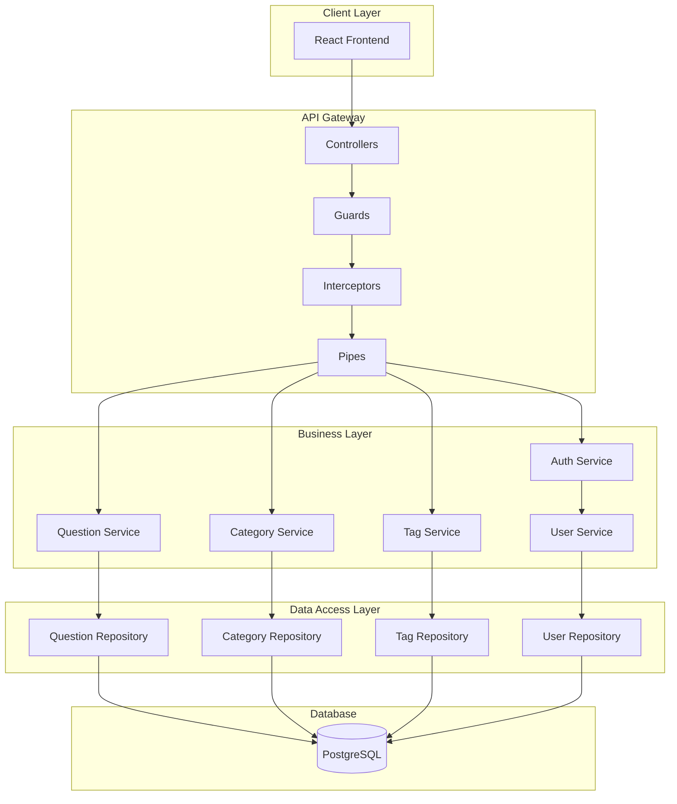
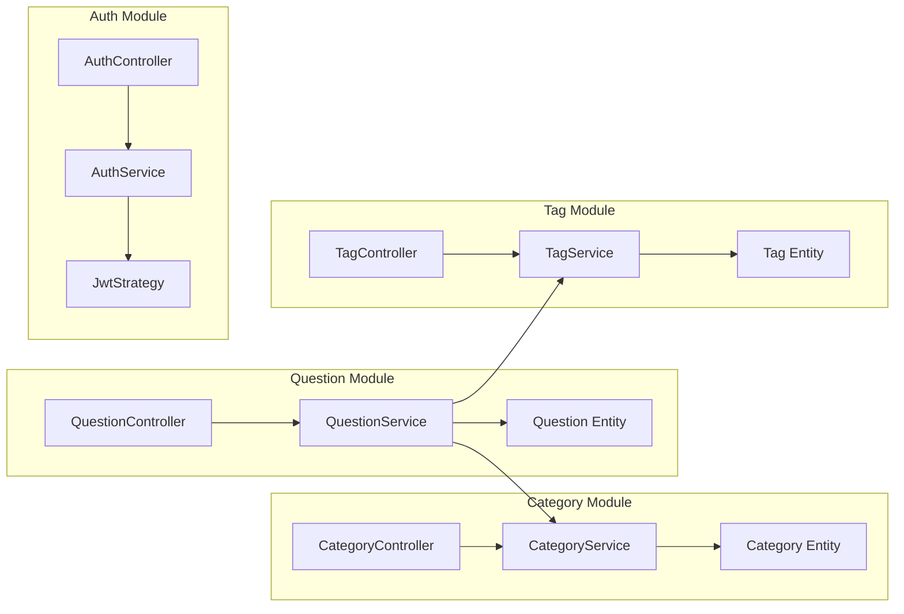
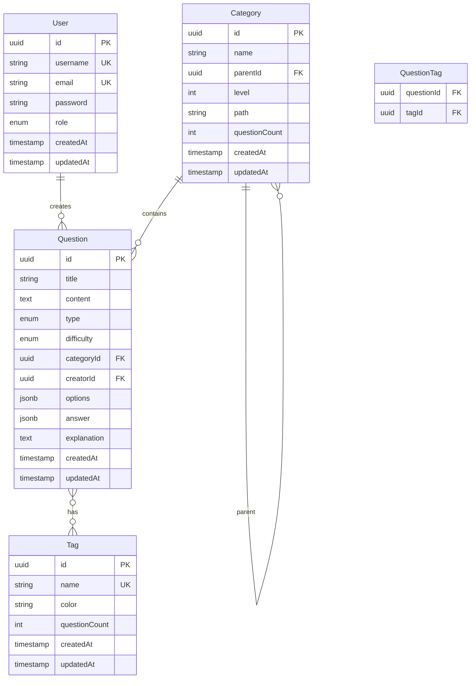

# Design Document: 题目后台管理系统后端服务

## Overview

本后端服务采用 NestJS 框架构建，遵循模块化、依赖注入和面向切面编程的设计原则。系统使用 TypeORM 进行数据持久化，JWT 进行身份认证，并提供完整的 RESTful API 接口。

## Architecture

### 技术栈选型

| 技术 | 版本 | 用途 |
|------|------|------|
| NestJS | 10.x | 后端框架 |
| TypeScript | 5.x | 类型安全 |
| TypeORM | 0.3.x | ORM 框架 |
| PostgreSQL | 15.x | 关系型数据库 |
| Passport | 0.7.x | 认证中间件 |
| JWT | - | 令牌认证 |
| class-validator | 0.14.x | 数据验证 |
| class-transformer | 0.5.x | 数据转换 |
| Swagger | 7.x | API 文档 |
| Jest | 29.x | 测试框架 |

### 系统架构图



### 目录结构

```
src/
├── main.ts                    # 应用入口
├── app.module.ts              # 根模块
├── common/                    # 公共模块
│   ├── decorators/           # 自定义装饰器
│   ├── filters/              # 异常过滤器
│   ├── guards/               # 守卫
│   ├── interceptors/         # 拦截器
│   ├── pipes/                # 管道
│   └── dto/                  # 公共 DTO
├── config/                    # 配置模块
│   ├── database.config.ts    # 数据库配置
│   ├── jwt.config.ts         # JWT 配置
│   └── app.config.ts         # 应用配置
├── modules/                   # 业务模块
│   ├── question/             # 题目模块
│   │   ├── question.module.ts
│   │   ├── question.controller.ts
│   │   ├── question.service.ts
│   │   ├── entities/
│   │   │   └── question.entity.ts
│   │   └── dto/
│   │       ├── create-question.dto.ts
│   │       ├── update-question.dto.ts
│   │       └── query-question.dto.ts
│   ├── category/             # 分类模块
│   │   ├── category.module.ts
│   │   ├── category.controller.ts
│   │   ├── category.service.ts
│   │   ├── entities/
│   │   │   └── category.entity.ts
│   │   └── dto/
│   ├── tag/                  # 标签模块
│   │   ├── tag.module.ts
│   │   ├── tag.controller.ts
│   │   ├── tag.service.ts
│   │   ├── entities/
│   │   │   └── tag.entity.ts
│   │   └── dto/
│   ├── auth/                 # 认证模块
│   │   ├── auth.module.ts
│   │   ├── auth.controller.ts
│   │   ├── auth.service.ts
│   │   ├── strategies/
│   │   │   ├── jwt.strategy.ts
│   │   │   └── local.strategy.ts
│   │   └── dto/
│   └── user/                 # 用户模块
│       ├── user.module.ts
│       ├── user.service.ts
│       ├── entities/
│       │   └── user.entity.ts
│       └── dto/
└── database/                  # 数据库相关
    ├── migrations/           # 数据库迁移
    └── seeds/                # 种子数据
```

## Components and Interfaces

### 核心模块设计



### API 接口设计

#### 题目接口

```typescript
// GET /questions - 获取题目列表
interface QueryQuestionDto {
  keyword?: string;
  categoryId?: string;
  type?: QuestionType;
  difficulty?: DifficultyLevel;
  tagIds?: string[];
  page?: number;
  pageSize?: number;
}

interface PaginatedResponse<T> {
  data: T[];
  total: number;
  page: number;
  pageSize: number;
}

// POST /questions - 创建题目
interface CreateQuestionDto {
  title: string;
  content: string;
  type: QuestionType;
  difficulty: DifficultyLevel;
  categoryId: string;
  tagIds?: string[];
  options?: OptionDto[];
  answer: string | string[];
  explanation?: string;
}

// PATCH /questions/:id - 更新题目
interface UpdateQuestionDto extends Partial<CreateQuestionDto> {}
```

#### 分类接口

```typescript
// GET /categories - 获取分类列表
// GET /categories/tree - 获取分类树

// POST /categories - 创建分类
interface CreateCategoryDto {
  name: string;
  parentId?: string;
}

// PATCH /categories/:id - 更新分类
interface UpdateCategoryDto {
  name?: string;
  parentId?: string;
}
```

#### 标签接口

```typescript
// GET /tags - 获取标签列表

// POST /tags - 创建标签
interface CreateTagDto {
  name: string;
  color?: string;
}

// PATCH /tags/:id - 更新标签
interface UpdateTagDto {
  name?: string;
  color?: string;
}
```

#### 认证接口

```typescript
// POST /auth/register - 用户注册
interface RegisterDto {
  username: string;
  password: string;
  email: string;
}

// POST /auth/login - 用户登录
interface LoginDto {
  username: string;
  password: string;
}

// 登录响应
interface LoginResponse {
  accessToken: string;
  refreshToken: string;
  user: UserInfo;
}
```

## Data Models

### 数据库实体设计



### TypeORM 实体定义

```typescript
// entities/question.entity.ts
@Entity('questions')
export class Question {
  @PrimaryGeneratedColumn('uuid')
  id: string;

  @Column({ length: 200 })
  title: string;

  @Column('text')
  content: string;

  @Column({ type: 'enum', enum: QuestionType })
  type: QuestionType;

  @Column({ type: 'enum', enum: DifficultyLevel })
  difficulty: DifficultyLevel;

  @ManyToOne(() => Category, category => category.questions)
  @JoinColumn({ name: 'categoryId' })
  category: Category;

  @Column('uuid')
  categoryId: string;

  @ManyToMany(() => Tag, tag => tag.questions)
  @JoinTable({ name: 'question_tags' })
  tags: Tag[];

  @Column('jsonb', { nullable: true })
  options: Option[];

  @Column('jsonb')
  answer: string | string[];

  @Column('text', { nullable: true })
  explanation: string;

  @ManyToOne(() => User, user => user.questions)
  @JoinColumn({ name: 'creatorId' })
  creator: User;

  @Column('uuid')
  creatorId: string;

  @CreateDateColumn()
  createdAt: Date;

  @UpdateDateColumn()
  updatedAt: Date;
}

// entities/category.entity.ts
@Entity('categories')
@Tree('materialized-path')
export class Category {
  @PrimaryGeneratedColumn('uuid')
  id: string;

  @Column({ length: 100 })
  name: string;

  @TreeParent()
  parent: Category;

  @Column('uuid', { nullable: true })
  parentId: string;

  @TreeChildren()
  children: Category[];

  @Column({ default: 1 })
  level: number;

  @Column({ default: '' })
  path: string;

  @Column({ default: 0 })
  questionCount: number;

  @OneToMany(() => Question, question => question.category)
  questions: Question[];

  @CreateDateColumn()
  createdAt: Date;

  @UpdateDateColumn()
  updatedAt: Date;
}

// entities/tag.entity.ts
@Entity('tags')
export class Tag {
  @PrimaryGeneratedColumn('uuid')
  id: string;

  @Column({ length: 50, unique: true })
  name: string;

  @Column({ length: 7, default: '#1890ff' })
  color: string;

  @Column({ default: 0 })
  questionCount: number;

  @ManyToMany(() => Question, question => question.tags)
  questions: Question[];

  @CreateDateColumn()
  createdAt: Date;

  @UpdateDateColumn()
  updatedAt: Date;
}

// entities/user.entity.ts
@Entity('users')
export class User {
  @PrimaryGeneratedColumn('uuid')
  id: string;

  @Column({ length: 50, unique: true })
  username: string;

  @Column({ length: 100, unique: true })
  email: string;

  @Column()
  password: string;

  @Column({ type: 'enum', enum: UserRole, default: UserRole.USER })
  role: UserRole;

  @OneToMany(() => Question, question => question.creator)
  questions: Question[];

  @CreateDateColumn()
  createdAt: Date;

  @UpdateDateColumn()
  updatedAt: Date;
}
```

### 枚举定义

```typescript
// enums/question-type.enum.ts
export enum QuestionType {
  SINGLE_CHOICE = 'single_choice',
  MULTIPLE_CHOICE = 'multiple_choice',
  TRUE_FALSE = 'true_false',
  FILL_BLANK = 'fill_blank',
  SHORT_ANSWER = 'short_answer',
}

// enums/difficulty-level.enum.ts
export enum DifficultyLevel {
  EASY = 'easy',
  MEDIUM = 'medium',
  HARD = 'hard',
}

// enums/user-role.enum.ts
export enum UserRole {
  ADMIN = 'admin',
  USER = 'user',
}
```

## Correctness Properties

### Property 1: 题目 CRUD 完整性

*For any* 题目创建请求，如果所有必填字段都有效，系统应成功创建题目并返回完整的题目数据。

**Validates: Requirements 1.4**

### Property 2: 分页数据一致性

*For any* 分页查询请求，返回的数据量应不超过 pageSize，且 total 应等于满足筛选条件的总记录数。

**Validates: Requirements 1.1, 1.2**

### Property 3: 筛选结果正确性

*For any* 筛选条件组合，返回的所有题目都应满足所有指定的筛选条件。

**Validates: Requirements 1.2**

### Property 4: 分类层级约束

*For any* 分类创建或更新操作，分类层级不应超过3级。

**Validates: Requirements 2.8**

### Property 5: 分类名称唯一性

*For any* 同级分类，名称应保持唯一。

**Validates: Requirements 2.6**

### Property 6: 标签名称唯一性

*For any* 标签，名称应全局唯一。

**Validates: Requirements 3.5**

### Property 7: 标签关联清理

*For any* 被删除的标签，所有题目中对该标签的引用应被自动移除。

**Validates: Requirements 3.6**

### Property 8: JWT 令牌有效性

*For any* 受保护的 API 请求，如果 JWT 令牌无效或过期，应返回 401 错误。

**Validates: Requirements 5.3**

### Property 9: 密码安全性

*For any* 用户密码，存储时应使用 bcrypt 加密，且原始密码不可逆向获取。

**Validates: Requirements 4.6**

### Property 10: 数据验证完整性

*For any* API 请求，如果请求参数不符合 DTO 定义的验证规则，应返回 400 错误和详细的验证错误信息。

**Validates: Requirements 6.3**

## Error Handling

### 统一错误响应格式

```typescript
interface ErrorResponse {
  statusCode: number;
  message: string;
  error: string;
  details?: Record<string, any>;
  timestamp: string;
  path: string;
}

// 示例
{
  "statusCode": 400,
  "message": "Validation failed",
  "error": "Bad Request",
  "details": {
    "title": ["title should not be empty"],
    "categoryId": ["categoryId must be a UUID"]
  },
  "timestamp": "2024-01-01T00:00:00.000Z",
  "path": "/api/questions"
}
```

### 全局异常过滤器

```typescript
@Catch()
export class AllExceptionsFilter implements ExceptionFilter {
  catch(exception: unknown, host: ArgumentsHost) {
    const ctx = host.switchToHttp();
    const response = ctx.getResponse<Response>();
    const request = ctx.getRequest<Request>();

    let status = HttpStatus.INTERNAL_SERVER_ERROR;
    let message = 'Internal server error';
    let details = undefined;

    if (exception instanceof HttpException) {
      status = exception.getStatus();
      const exceptionResponse = exception.getResponse();
      message = typeof exceptionResponse === 'string' 
        ? exceptionResponse 
        : (exceptionResponse as any).message;
      details = (exceptionResponse as any).details;
    }

    response.status(status).json({
      statusCode: status,
      message,
      error: HttpStatus[status],
      details,
      timestamp: new Date().toISOString(),
      path: request.url,
    });
  }
}
```

### 错误码定义

| 错误码 | HTTP 状态 | 描述 |
|--------|-----------|------|
| VALIDATION_ERROR | 400 | 请求参数验证失败 |
| UNAUTHORIZED | 401 | 未授权访问 |
| FORBIDDEN | 403 | 权限不足 |
| NOT_FOUND | 404 | 资源不存在 |
| CONFLICT | 409 | 资源冲突（如名称重复） |
| INTERNAL_ERROR | 500 | 服务器内部错误 |

## Testing Strategy

### 测试框架选型

| 工具 | 用途 |
|------|------|
| Jest | 单元测试和集成测试 |
| Supertest | HTTP 接口测试 |
| fast-check | 属性测试 |
| TypeORM | 测试数据库 |

### 测试类型

#### 单元测试
- Service 层业务逻辑测试
- 工具函数测试
- DTO 验证测试

#### 集成测试
- Controller 接口测试
- 数据库操作测试
- 认证流程测试

#### E2E 测试
- 完整业务流程测试
- API 契约测试

### 测试覆盖要求

- Service 层：100% 覆盖
- Controller 层：关键路径覆盖
- 属性测试：所有正确性属性

## Security Considerations

### 认证与授权

```typescript
// JWT 策略
@Injectable()
export class JwtStrategy extends PassportStrategy(Strategy) {
  constructor(private configService: ConfigService) {
    super({
      jwtFromRequest: ExtractJwt.fromAuthHeaderAsBearerToken(),
      ignoreExpiration: false,
      secretOrKey: configService.get('JWT_SECRET'),
    });
  }

  async validate(payload: JwtPayload) {
    return { userId: payload.sub, username: payload.username, role: payload.role };
  }
}

// 角色守卫
@Injectable()
export class RolesGuard implements CanActivate {
  constructor(private reflector: Reflector) {}

  canActivate(context: ExecutionContext): boolean {
    const requiredRoles = this.reflector.getAllAndOverride<UserRole[]>(ROLES_KEY, [
      context.getHandler(),
      context.getClass(),
    ]);
    if (!requiredRoles) return true;
    
    const { user } = context.switchToHttp().getRequest();
    return requiredRoles.includes(user.role);
  }
}
```

### 数据安全

- 密码使用 bcrypt 加密（salt rounds: 10）
- 敏感数据不在日志中输出
- SQL 注入防护（TypeORM 参数化查询）
- XSS 防护（输入验证和输出编码）

## Configuration

### 环境变量

```env
# 应用配置
NODE_ENV=development
PORT=3000
API_PREFIX=api

# 数据库配置
DB_HOST=localhost
DB_PORT=5432
DB_USERNAME=postgres
DB_PASSWORD=password
DB_DATABASE=question_manager

# JWT 配置
JWT_SECRET=your-secret-key
JWT_EXPIRES_IN=1h
JWT_REFRESH_EXPIRES_IN=7d

# 日志配置
LOG_LEVEL=debug
```

### 配置模块

```typescript
// config/configuration.ts
export default () => ({
  port: parseInt(process.env.PORT, 10) || 3000,
  database: {
    host: process.env.DB_HOST,
    port: parseInt(process.env.DB_PORT, 10) || 5432,
    username: process.env.DB_USERNAME,
    password: process.env.DB_PASSWORD,
    database: process.env.DB_DATABASE,
  },
  jwt: {
    secret: process.env.JWT_SECRET,
    expiresIn: process.env.JWT_EXPIRES_IN || '1h',
    refreshExpiresIn: process.env.JWT_REFRESH_EXPIRES_IN || '7d',
  },
});
```

## API Documentation

### Swagger 配置

```typescript
// main.ts
const config = new DocumentBuilder()
  .setTitle('题目管理系统 API')
  .setDescription('题目后台管理系统的 RESTful API 文档')
  .setVersion('1.0')
  .addBearerAuth()
  .addTag('questions', '题目管理')
  .addTag('categories', '分类管理')
  .addTag('tags', '标签管理')
  .addTag('auth', '用户认证')
  .build();

const document = SwaggerModule.createDocument(app, config);
SwaggerModule.setup('api/docs', app, document);
```

### API 装饰器示例

```typescript
@ApiTags('questions')
@Controller('questions')
export class QuestionController {
  @Get()
  @ApiOperation({ summary: '获取题目列表' })
  @ApiQuery({ name: 'keyword', required: false, description: '搜索关键词' })
  @ApiQuery({ name: 'categoryId', required: false, description: '分类ID' })
  @ApiResponse({ status: 200, description: '成功返回题目列表' })
  async findAll(@Query() query: QueryQuestionDto) {
    return this.questionService.findAll(query);
  }
}
```
