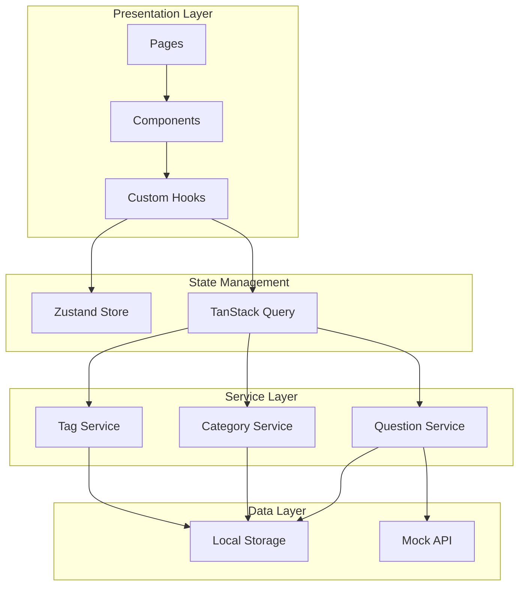
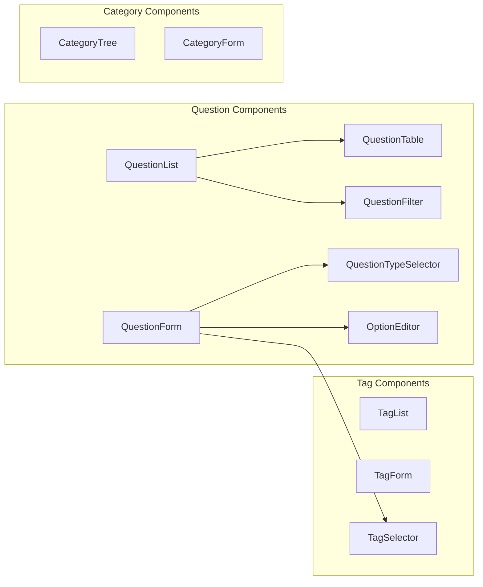

# Design Document: 题目后台管理系统

## Overview

本系统采用 React 19 技术栈构建，使用现代化的前端架构设计。系统采用组件化开发模式，使用 TypeScript 确保类型安全，采用 Zustand 进行状态管理，使用 TanStack Query 处理服务端状态，UI 组件库选用 Ant Design 5.x。

## Architecture

### 技术栈选型

| 技术 | 版本 | 用途 |
|------|------|------|
| React | 19.x | UI 框架 |
| TypeScript | 5.x | 类型安全 |
| Vite | 6.x | 构建工具 |
| React Router | 7.x | 路由管理 |
| Zustand | 5.x | 客户端状态管理 |
| TanStack Query | 5.x | 服务端状态管理 |
| Ant Design | 5.x | UI 组件库 |
| Axios | 1.x | HTTP 客户端 |

### 系统架构图



### 目录结构

```
src/
├── components/           # 可复用组件
│   ├── common/          # 通用组件
│   ├── question/        # 题目相关组件
│   ├── category/        # 分类相关组件
│   └── tag/             # 标签相关组件
├── pages/               # 页面组件
│   ├── QuestionList/    # 题目列表页
│   ├── QuestionForm/    # 题目表单页
│   ├── CategoryManage/  # 分类管理页
│   └── TagManage/       # 标签管理页
├── hooks/               # 自定义 Hooks
├── services/            # API 服务层
├── stores/              # Zustand 状态存储
├── types/               # TypeScript 类型定义
├── utils/               # 工具函数
└── constants/           # 常量定义
```

## Components and Interfaces

### 核心组件设计



### 组件接口定义

```typescript
// QuestionTable 组件
interface QuestionTableProps {
  questions: Question[];
  loading: boolean;
  pagination: PaginationConfig;
  onEdit: (id: string) => void;
  onDelete: (id: string) => void;
  onPageChange: (page: number, pageSize: number) => void;
}

// QuestionFilter 组件
interface QuestionFilterProps {
  filters: QuestionFilters;
  categories: Category[];
  onFilterChange: (filters: QuestionFilters) => void;
  onSearch: (keyword: string) => void;
  onReset: () => void;
}

// QuestionForm 组件
interface QuestionFormProps {
  initialValues?: Question;
  categories: Category[];
  tags: Tag[];
  onSubmit: (values: QuestionFormValues) => Promise<void>;
  onCancel: () => void;
}

// CategoryTree 组件
interface CategoryTreeProps {
  categories: Category[];
  onSelect: (categoryId: string) => void;
  onAdd: (parentId?: string) => void;
  onEdit: (category: Category) => void;
  onDelete: (categoryId: string) => void;
}

// TagSelector 组件
interface TagSelectorProps {
  value?: string[];
  tags: Tag[];
  onChange: (tagIds: string[]) => void;
}
```

### 自定义 Hooks

```typescript
// useQuestions - 题目数据管理
function useQuestions(filters?: QuestionFilters): {
  questions: Question[];
  total: number;
  loading: boolean;
  error: Error | null;
  refetch: () => void;
}

// useQuestion - 单个题目操作
function useQuestion(id?: string): {
  question: Question | null;
  loading: boolean;
  create: (data: QuestionFormValues) => Promise<Question>;
  update: (id: string, data: QuestionFormValues) => Promise<Question>;
  remove: (id: string) => Promise<void>;
}

// useCategories - 分类数据管理
function useCategories(): {
  categories: Category[];
  treeData: CategoryTreeNode[];
  loading: boolean;
  create: (data: CategoryFormValues) => Promise<Category>;
  update: (id: string, data: CategoryFormValues) => Promise<Category>;
  remove: (id: string) => Promise<void>;
}

// useTags - 标签数据管理
function useTags(): {
  tags: Tag[];
  loading: boolean;
  create: (data: TagFormValues) => Promise<Tag>;
  update: (id: string, data: TagFormValues) => Promise<Tag>;
  remove: (id: string) => Promise<void>;
}
```

## Data Models

### 核心数据模型

```typescript
// 题目类型枚举
enum QuestionType {
  SINGLE_CHOICE = 'single_choice',    // 单选题
  MULTIPLE_CHOICE = 'multiple_choice', // 多选题
  TRUE_FALSE = 'true_false',          // 判断题
  FILL_BLANK = 'fill_blank',          // 填空题
  SHORT_ANSWER = 'short_answer',      // 简答题
}

// 难度等级枚举
enum DifficultyLevel {
  EASY = 'easy',
  MEDIUM = 'medium',
  HARD = 'hard',
}

// 选项接口
interface Option {
  id: string;
  content: string;
  isCorrect: boolean;
}

// 题目接口
interface Question {
  id: string;
  title: string;
  content: string;
  type: QuestionType;
  difficulty: DifficultyLevel;
  categoryId: string;
  tagIds: string[];
  options?: Option[];           // 选择题选项
  answer: string | string[];    // 答案
  explanation?: string;         // 解析
  createdAt: string;
  updatedAt: string;
}

// 分类接口
interface Category {
  id: string;
  name: string;
  parentId: string | null;
  level: number;                // 层级 1-3
  path: string;                 // 路径，如 "1/2/3"
  questionCount: number;
  createdAt: string;
  updatedAt: string;
}

// 标签接口
interface Tag {
  id: string;
  name: string;
  color: string;
  questionCount: number;
  createdAt: string;
  updatedAt: string;
}

// 筛选条件接口
interface QuestionFilters {
  keyword?: string;
  categoryId?: string;
  type?: QuestionType;
  difficulty?: DifficultyLevel;
  tagIds?: string[];
  page: number;
  pageSize: number;
}

// 分页配置接口
interface PaginationConfig {
  current: number;
  pageSize: number;
  total: number;
}
```

### 状态存储设计

```typescript
// Zustand Store - UI 状态
interface UIStore {
  sidebarCollapsed: boolean;
  currentTheme: 'light' | 'dark';
  toggleSidebar: () => void;
  setTheme: (theme: 'light' | 'dark') => void;
}

// Zustand Store - 筛选状态
interface FilterStore {
  questionFilters: QuestionFilters;
  setQuestionFilters: (filters: Partial<QuestionFilters>) => void;
  resetQuestionFilters: () => void;
}
```


## Correctness Properties

*A property is a characteristic or behavior that should hold true across all valid executions of a system—essentially, a formal statement about what the system should do. Properties serve as the bridge between human-readable specifications and machine-verifiable correctness guarantees.*

### Property 1: 题目列表渲染完整性

*For any* 题目数据，渲染后的列表项应包含标题、类型、分类、难度和创建时间所有字段。

**Validates: Requirements 1.2**

### Property 2: 分页数据一致性

*For any* 分页参数（页码、每页数量），返回的题目数量应不超过每页数量，且总数应与实际数据量一致。

**Validates: Requirements 1.1, 1.3**

### Property 3: 筛选结果正确性

*For any* 筛选条件组合（分类、难度、类型、标签），返回的所有题目都应满足所有指定的筛选条件。

**Validates: Requirements 2.2, 2.3, 2.4, 2.5**

### Property 4: 搜索结果相关性

*For any* 搜索关键词，返回的所有题目的标题或内容中应包含该关键词（不区分大小写）。

**Validates: Requirements 2.1**

### Property 5: 表单验证完整性

*For any* 题目表单数据，如果缺少必填字段（标题、类型、分类、答案），验证应返回失败并指出缺失字段。

**Validates: Requirements 3.2, 3.3**

### Property 6: 题目类型支持完整性

*For any* 题目类型（单选、多选、判断、填空、简答），系统应能成功创建并保存该类型的题目。

**Validates: Requirements 3.5**

### Property 7: 题目更新一致性

*For any* 题目，编辑并保存后，重新加载的数据应与保存的数据完全一致。

**Validates: Requirements 4.1, 4.2**

### Property 8: 删除操作原子性

*For any* 题目，删除成功后该题目应不再出现在列表中；删除失败时题目应保持不变。

**Validates: Requirements 5.2, 5.4**

### Property 9: 分类层级约束

*For any* 分类操作，分类层级不应超过3级，且每个分类的路径应正确反映其层级关系。

**Validates: Requirements 6.2, 6.5**

### Property 10: 分类名称唯一性

*For any* 同级分类，名称应保持唯一，创建重复名称的分类应被拒绝。

**Validates: Requirements 6.3**

### Property 11: 分类删除约束

*For any* 包含题目的分类，删除操作应被阻止并返回相应提示。

**Validates: Requirements 6.4**

### Property 12: 标签名称唯一性

*For any* 标签，名称应保持唯一，创建重复名称的标签应被拒绝。

**Validates: Requirements 7.2**

### Property 13: 标签关联清理

*For any* 被删除的标签，所有题目中对该标签的引用应被自动移除。

**Validates: Requirements 7.4**

### Property 14: 数据持久化往返

*For any* 题目/分类/标签数据，序列化到 localStorage 后再反序列化，应得到与原始数据等价的对象。

**Validates: Requirements 8.1, 8.2, 8.3**

## Error Handling

### 错误处理策略

```typescript
// 错误类型定义
enum ErrorType {
  VALIDATION_ERROR = 'VALIDATION_ERROR',
  NOT_FOUND = 'NOT_FOUND',
  DUPLICATE_ERROR = 'DUPLICATE_ERROR',
  CONSTRAINT_ERROR = 'CONSTRAINT_ERROR',
  STORAGE_ERROR = 'STORAGE_ERROR',
  NETWORK_ERROR = 'NETWORK_ERROR',
}

interface AppError {
  type: ErrorType;
  message: string;
  field?: string;
  details?: Record<string, unknown>;
}

// 错误处理 Hook
function useErrorHandler(): {
  error: AppError | null;
  setError: (error: AppError) => void;
  clearError: () => void;
  handleError: (error: unknown) => void;
}
```

### 错误场景处理

| 场景 | 错误类型 | 处理方式 |
|------|----------|----------|
| 表单验证失败 | VALIDATION_ERROR | 显示字段级错误提示 |
| 题目不存在 | NOT_FOUND | 显示错误页面，提供返回列表选项 |
| 分类名称重复 | DUPLICATE_ERROR | 显示提示，要求修改名称 |
| 删除有题目的分类 | CONSTRAINT_ERROR | 显示确认对话框，提示先处理题目 |
| localStorage 已满 | STORAGE_ERROR | 显示提示，建议清理数据 |
| 数据加载失败 | NETWORK_ERROR | 显示重试按钮 |

## Testing Strategy

### 测试框架选型

| 工具 | 用途 |
|------|------|
| Vitest | 单元测试框架 |
| React Testing Library | 组件测试 |
| fast-check | 属性测试库 |
| MSW | API Mock |

### 测试类型

#### 单元测试
- 工具函数测试
- 数据验证逻辑测试
- 状态管理逻辑测试

#### 属性测试
- 使用 fast-check 进行属性测试
- 每个属性测试运行至少 100 次迭代
- 测试标注格式：`// Feature: question-management-system, Property N: [property description]`

#### 组件测试
- 使用 React Testing Library 测试组件渲染
- 测试用户交互行为
- 测试组件状态变化

### 测试覆盖要求

- 核心业务逻辑：100% 覆盖
- 工具函数：100% 覆盖
- 组件渲染：关键路径覆盖
- 属性测试：所有正确性属性
