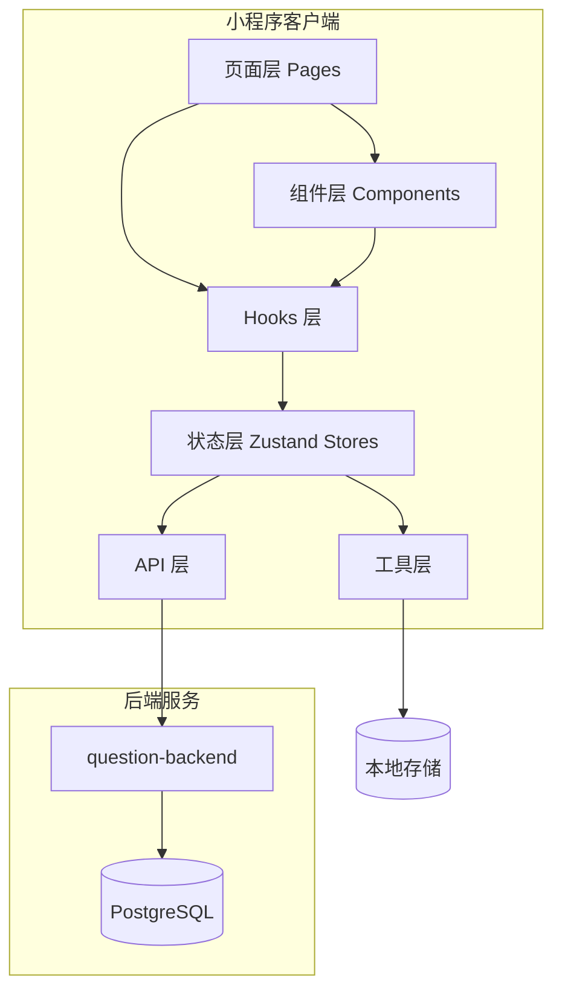
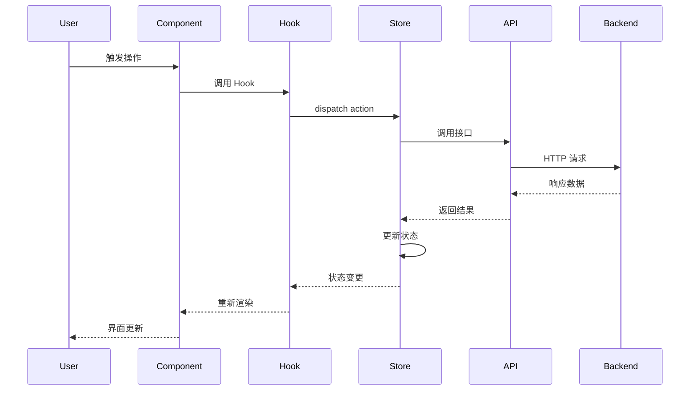

# Design Document

## Overview

本设计文档描述基于 Taro 4 + React 19 + TypeScript + Zustand 的刷题小程序技术架构。小程序对接现有的 question-backend 后端服务，实现题目浏览、在线答题、错题本、收藏夹、学习统计等功能。

### 技术栈

- **框架**: Taro 4.x + React 19
- **语言**: TypeScript 5.x
- **状态管理**: Zustand + zustand/middleware (persist)
- **样式**: SCSS + CSS Variables
- **HTTP 请求**: Taro.request 封装
- **目标平台**: 微信小程序

### 项目结构

```
question-miniapp-taro/
├── src/
│   ├── api/                 # API 接口层
│   │   ├── request.ts       # 请求封装
│   │   ├── auth.ts          # 认证接口
│   │   ├── question.ts      # 题目接口
│   │   ├── category.ts      # 分类接口
│   │   └── study.ts         # 学习记录接口
│   ├── components/          # 公共组件
│   │   ├── QuestionCard/    # 题目卡片
│   │   ├── OptionItem/      # 选项组件
│   │   ├── RichText/        # 富文本渲染
│   │   ├── DifficultyTag/   # 难度标签
│   │   └── EmptyState/      # 空状态
│   ├── pages/               # 页面
│   │   ├── index/           # 首页
│   │   ├── category/        # 分类页
│   │   ├── question/        # 题目相关页面
│   │   ├── wrong-book/      # 错题本
│   │   ├── favorites/       # 收藏夹
│   │   ├── statistics/      # 统计页
│   │   ├── user/            # 个人中心
│   │   └── login/           # 登录页
│   ├── stores/              # Zustand 状态管理
│   │   ├── userStore.ts     # 用户状态
│   │   ├── questionStore.ts # 题目状态
│   │   ├── studyStore.ts    # 学习记录状态
│   │   └── index.ts         # 统一导出
│   ├── hooks/               # 自定义 Hooks
│   │   ├── useAuth.ts       # 认证 Hook
│   │   ├── useQuestion.ts   # 题目 Hook
│   │   └── useStudy.ts      # 学习记录 Hook
```
│   ├── types/               # 类型定义
│   │   ├── question.ts      # 题目类型
│   │   ├── category.ts      # 分类类型
│   │   ├── user.ts          # 用户类型
│   │   └── api.ts           # API 响应类型
│   ├── utils/               # 工具函数
│   │   ├── storage.ts       # 本地存储
│   │   ├── format.ts        # 格式化工具
│   │   └── validator.ts     # 验证工具
│   ├── styles/              # 全局样式
│   │   ├── variables.scss   # 样式变量
│   │   └── common.scss      # 公共样式
│   ├── app.ts               # 应用入口
│   ├── app.config.ts        # 应用配置
│   └── app.scss             # 应用样式
├── config/                  # Taro 配置
├── package.json
└── tsconfig.json
```

## Architecture

### 整体架构图



### 数据流架构



## Components and Interfaces

### API 请求封装

```typescript
// src/api/request.ts
import Taro from '@tarojs/taro'
import { useUserStore } from '@/stores/userStore'

interface RequestConfig {
  url: string
  method?: 'GET' | 'POST' | 'PUT' | 'DELETE' | 'PATCH'
  data?: any
  header?: Record<string, string>
  showLoading?: boolean
  showError?: boolean
}

interface ApiResponse<T = any> {
  statusCode: number
  message: string
  data: T
  timestamp: string
}

const BASE_URL = process.env.TARO_APP_API_URL || 'http://localhost:3000/api'

export async function request<T>(config: RequestConfig): Promise<T> {
  const { url, method = 'GET', data, header = {}, showLoading = true, showError = true } = config
  
  if (showLoading) {
    Taro.showLoading({ title: '加载中...' })
  }
  
  const token = useUserStore.getState().token
  
  try {
    const response = await Taro.request({
      url: `${BASE_URL}${url}`,
      method,
      data,
      header: {
        'Content-Type': 'application/json',
        ...(token ? { Authorization: `Bearer ${token}` } : {}),
        ...header,
      },
    })
    
    if (showLoading) {
      Taro.hideLoading()
    }
    
    if (response.statusCode === 401) {
      useUserStore.getState().logout()
      Taro.navigateTo({ url: '/pages/login/index' })
      throw new Error('登录已过期，请重新登录')
    }
    
    if (response.statusCode >= 400) {
      const errorMsg = (response.data as ApiResponse).message || '请求失败'
      if (showError) {
        Taro.showToast({ title: errorMsg, icon: 'none' })
      }
      throw new Error(errorMsg)
    }
    
    return (response.data as ApiResponse<T>).data
  } catch (error) {
    if (showLoading) {
      Taro.hideLoading()
    }
    throw error
  }
}

export const http = {
  get: <T>(url: string, params?: any, config?: Partial<RequestConfig>) =>
    request<T>({ url: params ? `${url}?${new URLSearchParams(params)}` : url, method: 'GET', ...config }),
  post: <T>(url: string, data?: any, config?: Partial<RequestConfig>) =>
    request<T>({ url, method: 'POST', data, ...config }),
  put: <T>(url: string, data?: any, config?: Partial<RequestConfig>) =>
    request<T>({ url, method: 'PUT', data, ...config }),
  delete: <T>(url: string, config?: Partial<RequestConfig>) =>
    request<T>({ url, method: 'DELETE', ...config }),
}
```

### 题目 API 接口

```typescript
// src/api/question.ts
import { http } from './request'
import type { Question, PaginatedResponse, QueryQuestionDto } from '@/types'

export const questionApi = {
  getList: (params: QueryQuestionDto) =>
    http.get<PaginatedResponse<Question>>('/questions', params),

  getDetail: (id: string) =>
    http.get<Question>(`/questions/${id}`),

  getRandom: (params: { categoryId?: string; difficulty?: string; count?: number }) =>
    http.get<Question[]>('/questions/random', params),
}
```

### 用户状态管理 (Zustand)

```typescript
// src/stores/userStore.ts
import { create } from 'zustand'
import { persist, createJSONStorage } from 'zustand/middleware'
import Taro from '@tarojs/taro'
import { authApi } from '@/api/auth'
import type { UserInfo } from '@/types'

interface UserState {
  token: string | null
  refreshToken: string | null
  userInfo: UserInfo | null
  isLoggedIn: boolean
}

interface UserActions {
  wxLogin: () => Promise<void>
  refreshAccessToken: () => Promise<void>
  logout: () => void
  setToken: (token: string, refreshToken: string) => void
  setUserInfo: (userInfo: UserInfo) => void
}

const taroStorage = {
  getItem: (name: string) => {
    const value = Taro.getStorageSync(name)
    return value ? JSON.stringify(value) : null
  },
  setItem: (name: string, value: string) => {
    Taro.setStorageSync(name, JSON.parse(value))
  },
  removeItem: (name: string) => {
    Taro.removeStorageSync(name)
  },
}

export const useUserStore = create<UserState & UserActions>()(
  persist(
    (set, get) => ({
      token: null,
      refreshToken: null,
      userInfo: null,
      isLoggedIn: false,

      wxLogin: async () => {
        const { code } = await Taro.login()
        const result = await authApi.wxLogin(code)
        set({
          token: result.accessToken,
          refreshToken: result.refreshToken,
          userInfo: result.user,
          isLoggedIn: true,
        })
      },

      refreshAccessToken: async () => {
        const { refreshToken } = get()
        if (!refreshToken) throw new Error('No refresh token')
        const result = await authApi.refresh(refreshToken)
        set({
          token: result.accessToken,
          refreshToken: result.refreshToken,
        })
      },

      logout: () => {
        set({
          token: null,
          refreshToken: null,
          userInfo: null,
          isLoggedIn: false,
        })
      },

      setToken: (token, refreshToken) => set({ token, refreshToken, isLoggedIn: true }),
      setUserInfo: (userInfo) => set({ userInfo }),
    }),
    {
      name: 'user-store',
      storage: createJSONStorage(() => taroStorage),
    }
  )
)
```

### 学习记录状态管理

```typescript
// src/stores/studyStore.ts
import { create } from 'zustand'
import { persist, createJSONStorage } from 'zustand/middleware'
import Taro from '@tarojs/taro'
import { studyApi } from '@/api/study'
import type { StudyRecord, WrongQuestion, FavoriteQuestion } from '@/types'

interface StudyState {
  todayStats: { answered: number; correct: number; wrong: number }
  wrongQuestions: WrongQuestion[]
  favorites: FavoriteQuestion[]
  pendingRecords: StudyRecord[]
}

interface StudyActions {
  recordAnswer: (questionId: string, isCorrect: boolean, userAnswer: string | string[]) => Promise<void>
  addToWrongBook: (questionId: string) => void
  removeFromWrongBook: (questionId: string) => void
  toggleFavorite: (questionId: string) => boolean
  isFavorite: (questionId: string) => boolean
  syncPendingRecords: () => Promise<void>
  getTodayAccuracy: () => number
}

const taroStorage = {
  getItem: (name: string) => {
    const value = Taro.getStorageSync(name)
    return value ? JSON.stringify(value) : null
  },
  setItem: (name: string, value: string) => {
    Taro.setStorageSync(name, JSON.parse(value))
  },
  removeItem: (name: string) => {
    Taro.removeStorageSync(name)
  },
}

export const useStudyStore = create<StudyState & StudyActions>()(
  persist(
    (set, get) => ({
      todayStats: { answered: 0, correct: 0, wrong: 0 },
      wrongQuestions: [],
      favorites: [],
      pendingRecords: [],

      recordAnswer: async (questionId, isCorrect, userAnswer) => {
        const record: StudyRecord = {
          questionId,
          isCorrect,
          userAnswer,
          answeredAt: new Date().toISOString(),
        }

        set((state) => ({
          todayStats: {
            answered: state.todayStats.answered + 1,
            correct: state.todayStats.correct + (isCorrect ? 1 : 0),
            wrong: state.todayStats.wrong + (isCorrect ? 0 : 1),
          },
        }))

        if (!isCorrect) {
          get().addToWrongBook(questionId)
        }

        try {
          await studyApi.recordAnswer(record)
        } catch {
          set((state) => ({
            pendingRecords: [...state.pendingRecords, record],
          }))
        }
      },

      addToWrongBook: (questionId) => {
        set((state) => {
          if (state.wrongQuestions.find((q) => q.questionId === questionId)) {
            return state
          }
          return {
            wrongQuestions: [
              ...state.wrongQuestions,
              { questionId, addedAt: new Date().toISOString(), reviewCount: 0 },
            ],
          }
        })
      },

      removeFromWrongBook: (questionId) => {
        set((state) => ({
          wrongQuestions: state.wrongQuestions.filter((q) => q.questionId !== questionId),
        }))
      },

      toggleFavorite: (questionId) => {
        const { favorites } = get()
        const index = favorites.findIndex((f) => f.questionId === questionId)
        if (index > -1) {
          set((state) => ({
            favorites: state.favorites.filter((f) => f.questionId !== questionId),
          }))
          return false
        } else {
          set((state) => ({
            favorites: [...state.favorites, { questionId, addedAt: new Date().toISOString() }],
          }))
          return true
        }
      },

      isFavorite: (questionId) => {
        return get().favorites.some((f) => f.questionId === questionId)
      },

      syncPendingRecords: async () => {
        const { pendingRecords } = get()
        if (pendingRecords.length === 0) return
        try {
          await studyApi.batchRecordAnswers(pendingRecords)
          set({ pendingRecords: [] })
        } catch {
          console.error('同步失败，稍后重试')
        }
      },

      getTodayAccuracy: () => {
        const { todayStats } = get()
        if (todayStats.answered === 0) return 0
        return Math.round((todayStats.correct / todayStats.answered) * 100)
      },
    }),
    {
      name: 'study-store',
      storage: createJSONStorage(() => taroStorage),
    }
  )
)
```

### 题目卡片组件 (React)

```tsx
// src/components/QuestionCard/index.tsx
import { View, Text } from '@tarojs/components'
import Taro from '@tarojs/taro'
import { DifficultyTag } from '../DifficultyTag'
import type { Question } from '@/types'
import { QuestionTypeLabels } from '@/types'
import './index.scss'

interface QuestionCardProps {
  question: Question
  categoryName?: string
}

export const QuestionCard: React.FC<QuestionCardProps> = ({ question, categoryName }) => {
  const handleTap = () => {
    Taro.navigateTo({ url: `/pages/question/detail?id=${question.id}` })
  }

  return (
    <View className="question-card" onClick={handleTap}>
      <View className="card-header">
        <View className={`type-tag type-${question.type}`}>
          {QuestionTypeLabels[question.type] || '未知'}
        </View>
        <DifficultyTag level={question.difficulty} />
      </View>
      <View className="card-title">{question.title}</View>
      {categoryName && (
        <View className="card-footer">
          <Text className="category">{categoryName}</Text>
        </View>
      )}
    </View>
  )
}
```

### 选项组件 (React)

```tsx
// src/components/OptionItem/index.tsx
import { View, Text } from '@tarojs/components'
import { RichText } from '../RichText'
import type { QuestionOption } from '@/types'
import { getRenderedContent } from '@/utils/format'
import './index.scss'

interface OptionItemProps {
  option: QuestionOption
  index: number
  isSelected: boolean
  showResult: boolean
  disabled: boolean
  onSelect: (optionId: string) => void
}

const labels = ['A', 'B', 'C', 'D', 'E', 'F', 'G', 'H']

export const OptionItem: React.FC<OptionItemProps> = ({
  option,
  index,
  isSelected,
  showResult,
  disabled,
  onSelect,
}) => {
  const label = labels[index] || String(index + 1)
  const content = getRenderedContent(option.content)
  const isCorrect = option.isCorrect

  const getClassName = () => {
    const classes = ['option-item']
    if (isSelected) classes.push('is-selected')
    if (showResult && isCorrect) classes.push('is-correct')
    if (showResult && isSelected && !isCorrect) classes.push('is-wrong')
    if (disabled) classes.push('is-disabled')
    return classes.join(' ')
  }

  const handleClick = () => {
    if (!disabled) {
      onSelect(option.id)
    }
  }

  return (
    <View className={getClassName()} onClick={handleClick}>
      <View className="option-label">{label}</View>
      <View className="option-content">
        <RichText content={content} />
      </View>
      {showResult && (
        <View className="option-icon">
          {isCorrect && <Text className="icon-correct">✓</Text>}
          {isSelected && !isCorrect && <Text className="icon-wrong">✗</Text>}
        </View>
      )}
    </View>
  )
}
```

### 富文本渲染组件 (React)

```tsx
// src/components/RichText/index.tsx
import { RichText as TaroRichText } from '@tarojs/components'
import type { RichContent } from '@/types'
import './index.scss'

interface RichTextProps {
  content: string | RichContent
}

export const RichText: React.FC<RichTextProps> = ({ content }) => {
  const processedContent = typeof content === 'string' 
    ? content 
    : content.rendered || content.raw

  return <TaroRichText nodes={processedContent} className="rich-text-content" />
}
```

### 自定义 Hooks

```typescript
// src/hooks/useQuestion.ts
import { useState, useCallback } from 'react'
import { questionApi } from '@/api/question'
import type { Question, QueryQuestionDto, PaginatedResponse } from '@/types'

export const useQuestionList = (initialParams?: Partial<QueryQuestionDto>) => {
  const [questions, setQuestions] = useState<Question[]>([])
  const [loading, setLoading] = useState(false)
  const [hasMore, setHasMore] = useState(true)
  const [params, setParams] = useState<QueryQuestionDto>({
    page: 1,
    pageSize: 10,
    ...initialParams,
  })

  const fetchQuestions = useCallback(async (reset = false) => {
    if (loading) return
    setLoading(true)

    try {
      const currentParams = reset ? { ...params, page: 1 } : params
      const result = await questionApi.getList(currentParams)
      
      if (reset) {
        setQuestions(result.data)
      } else {
        setQuestions((prev) => [...prev, ...result.data])
      }
      
      setHasMore(result.page < result.totalPages)
      setParams((prev) => ({ ...prev, page: currentParams.page + 1 }))
    } finally {
      setLoading(false)
    }
  }, [params, loading])

  const updateFilters = useCallback((newFilters: Partial<QueryQuestionDto>) => {
    setParams((prev) => ({ ...prev, ...newFilters, page: 1 }))
    setQuestions([])
    setHasMore(true)
  }, [])

  return { questions, loading, hasMore, fetchQuestions, updateFilters }
}

// src/hooks/useAnswer.ts
import { useState, useCallback } from 'react'
import { useStudyStore } from '@/stores/studyStore'
import type { Question, QuestionOption } from '@/types'
import { validateAnswer } from '@/utils/validator'

export const useAnswer = (question: Question | null) => {
  const [selectedIds, setSelectedIds] = useState<string[]>([])
  const [submitted, setSubmitted] = useState(false)
  const [isCorrect, setIsCorrect] = useState(false)
  const recordAnswer = useStudyStore((state) => state.recordAnswer)

  const toggleOption = useCallback((optionId: string) => {
    if (submitted || !question) return

    if (question.type === 'single_choice' || question.type === 'true_false') {
      setSelectedIds([optionId])
    } else {
      setSelectedIds((prev) =>
        prev.includes(optionId)
          ? prev.filter((id) => id !== optionId)
          : [...prev, optionId]
      )
    }
  }, [submitted, question])

  const submitAnswer = useCallback(async () => {
    if (!question || selectedIds.length === 0) return

    const correct = validateAnswer(question, selectedIds)
    setIsCorrect(correct)
    setSubmitted(true)
    await recordAnswer(question.id, correct, selectedIds)
  }, [question, selectedIds, recordAnswer])

  const reset = useCallback(() => {
    setSelectedIds([])
    setSubmitted(false)
    setIsCorrect(false)
  }, [])

  return { selectedIds, submitted, isCorrect, toggleOption, submitAnswer, reset }
}
```

## Data Models

### 题目类型定义

```typescript
// src/types/question.ts

export const QuestionType = {
  SINGLE_CHOICE: 'single_choice',
  MULTIPLE_CHOICE: 'multiple_choice',
  TRUE_FALSE: 'true_false',
  FILL_BLANK: 'fill_blank',
  SHORT_ANSWER: 'short_answer',
} as const

export type QuestionType = typeof QuestionType[keyof typeof QuestionType]

export const QuestionTypeLabels: Record<QuestionType, string> = {
  [QuestionType.SINGLE_CHOICE]: '单选',
  [QuestionType.MULTIPLE_CHOICE]: '多选',
  [QuestionType.TRUE_FALSE]: '判断',
  [QuestionType.FILL_BLANK]: '填空',
  [QuestionType.SHORT_ANSWER]: '简答',
}

export const DifficultyLevel = {
  EASY: 'easy',
  MEDIUM: 'medium',
  HARD: 'hard',
} as const

export type DifficultyLevel = typeof DifficultyLevel[keyof typeof DifficultyLevel]

export const DifficultyLabels: Record<DifficultyLevel, string> = {
  [DifficultyLevel.EASY]: '简单',
  [DifficultyLevel.MEDIUM]: '中等',
  [DifficultyLevel.HARD]: '困难',
}

export interface RichContent {
  raw: string
  rendered: string
}

export interface QuestionOption {
  id: string
  content: RichContent
  isCorrect: boolean
}

export interface Question {
  id: string
  title: string
  content: RichContent
  type: QuestionType
  difficulty: DifficultyLevel
  categoryId: string
  category?: Category
  tags?: Tag[]
  options?: QuestionOption[]
  answer: string | string[]
  explanation?: RichContent
  createdAt: string
  updatedAt: string
}

export interface QueryQuestionDto {
  page?: number
  pageSize?: number
  keyword?: string
  categoryId?: string
  type?: QuestionType
  difficulty?: DifficultyLevel
  tagIds?: string[]
}
```

### 学习记录类型定义

```typescript
// src/types/study.ts

export interface StudyRecord {
  questionId: string
  isCorrect: boolean
  userAnswer: string | string[]
  answeredAt: string
}

export interface WrongQuestion {
  questionId: string
  addedAt: string
  reviewCount: number
  lastReviewAt?: string
}

export interface FavoriteQuestion {
  questionId: string
  addedAt: string
}

export interface StudyStatistics {
  totalAnswered: number
  totalCorrect: number
  totalWrong: number
  accuracy: number
  streakDays: number
  todayAnswered: number
  todayCorrect: number
  categoryStats: CategoryStat[]
  difficultyStats: DifficultyStat[]
  weeklyTrend: DailyTrend[]
}
```

### API 响应类型

```typescript
// src/types/api.ts

export interface ApiResponse<T = any> {
  statusCode: number
  message: string
  data: T
  timestamp: string
}

export interface PaginatedResponse<T> {
  data: T[]
  total: number
  page: number
  pageSize: number
  totalPages: number
}

export interface LoginResponse {
  accessToken: string
  refreshToken: string
  user: UserInfo
}
```

## Correctness Properties

*A property is a characteristic or behavior that should hold true across all valid executions of a system-essentially, a formal statement about what the system should do. Properties serve as the bridge between human-readable specifications and machine-verifiable correctness guarantees.*

### Property 1: Login State Persistence

*For any* successful login response containing a valid token and user info, storing the login state SHALL result in the user store having `isLoggedIn = true`, a non-null `token`, and the correct `userInfo`.

**Validates: Requirements 1.4**

### Property 2: Category Tree Structure Integrity

*For any* category tree returned from the API, all nodes with children SHALL have `children` as a non-empty array, and leaf nodes SHALL have either no `children` property or an empty array.

**Validates: Requirements 3.2**

### Property 3: Pagination Parameter Construction

*For any* page number and page size, the constructed query parameters SHALL include `page` equal to the requested page and `pageSize` equal to the requested size, and the resulting offset SHALL equal `(page - 1) * pageSize`.

**Validates: Requirements 4.1, 4.3**

### Property 4: Filter Parameter Construction

*For any* combination of filter values (categoryId, type, difficulty, tagIds), the constructed query parameters SHALL only include non-empty filter values, and empty/undefined filters SHALL be omitted from the request.

**Validates: Requirements 4.3**

### Property 5: Rich Content Extraction

*For any* content that is either a string or a RichContent object, the `getRenderedContent` function SHALL return the string directly if content is a string, or return `rendered` (falling back to `raw`) if content is a RichContent object.

**Validates: Requirements 5.2, 11.1, 11.2, 11.3, 11.4, 11.5**

### Property 6: Multiple Choice Selection Toggle

*For any* set of selected option IDs and a new option ID to toggle, if the option is already selected, it SHALL be removed from the set; if not selected, it SHALL be added to the set.

**Validates: Requirements 5.4**

### Property 7: Answer Validation - Single Choice

*For any* single choice question with options where exactly one option has `isCorrect = true`, and any user-selected option ID, the answer SHALL be correct if and only if the selected option ID matches the correct option's ID.

**Validates: Requirements 5.5**

### Property 8: Answer Validation - Multiple Choice

*For any* multiple choice question with options where one or more options have `isCorrect = true`, and any set of user-selected option IDs, the answer SHALL be correct if and only if the set of selected IDs exactly matches the set of correct option IDs.

**Validates: Requirements 5.5**

### Property 9: Wrong Book Addition on Incorrect Answer

*For any* question ID and an incorrect answer result, recording the answer SHALL result in the question being added to the wrong book if not already present, and the wrong book SHALL contain the question ID after the operation.

**Validates: Requirements 5.8**

### Property 10: Favorite Toggle Idempotence

*For any* question ID, toggling favorite twice SHALL return the favorites list to its original state (either containing or not containing the question ID).

**Validates: Requirements 5.10**

### Property 11: Study Statistics Accuracy Calculation

*For any* study statistics with `totalAnswered > 0`, the `accuracy` SHALL equal `Math.round((totalCorrect / totalAnswered) * 100)`, and for `totalAnswered = 0`, accuracy SHALL be 0.

**Validates: Requirements 8.1, 8.2, 8.3, 8.4**

### Property 12: Local Storage Round Trip

*For any* study record object, storing it to local storage and then retrieving it SHALL produce an equivalent object (serialization round trip).

**Validates: Requirements 10.1**

### Property 13: Pending Records Sync Queue

*For any* sequence of answer records added while offline, the pending records queue SHALL contain all records in the order they were added, and after successful sync, the queue SHALL be empty.

**Validates: Requirements 10.2**

## Error Handling

### Network Errors

- 所有 API 请求失败时显示友好的错误提示
- 提供重试机制
- 关键数据（学习记录）在网络失败时缓存到本地

### Validation Errors

- 表单输入验证失败时显示具体错误信息
- 防止提交无效数据

### Authentication Errors

- Token 过期时自动尝试刷新
- 刷新失败时引导用户重新登录
- 清除本地敏感数据

## Testing Strategy

### Unit Tests

单元测试覆盖核心业务逻辑：

1. **工具函数测试**
   - `getRenderedContent` / `getRawContent` 富文本内容提取
   - `validateAnswer` 答案验证函数
   - 日期格式化函数

2. **Store 测试**
   - User Store: 登录状态管理、Token 存储
   - Study Store: 答题记录、错题本、收藏夹操作
   - 统计数据计算

3. **Hooks 测试**
   - useAnswer: 答题状态管理
   - useQuestionList: 分页加载逻辑

### Property-Based Tests

使用 fast-check 进行属性测试：

1. **Property 5**: 富文本内容提取 - 测试各种输入类型
2. **Property 6**: 多选切换 - 测试任意选项组合
3. **Property 7 & 8**: 答案验证 - 测试各种题目和答案组合
4. **Property 10**: 收藏切换幂等性 - 测试双重切换
5. **Property 11**: 正确率计算 - 测试各种统计数据
6. **Property 12**: 本地存储往返 - 测试序列化/反序列化

### Test Configuration

```typescript
// vitest.config.ts
import { defineConfig } from 'vitest/config'
import path from 'path'

export default defineConfig({
  test: {
    environment: 'jsdom',
    globals: true,
    include: ['src/**/*.{test,spec}.{js,ts,tsx}'],
    coverage: {
      provider: 'v8',
      reporter: ['text', 'json', 'html'],
    },
  },
  resolve: {
    alias: {
      '@': path.resolve(__dirname, './src'),
    },
  },
})
```

Property-based tests should run with minimum 100 iterations to ensure comprehensive coverage.
