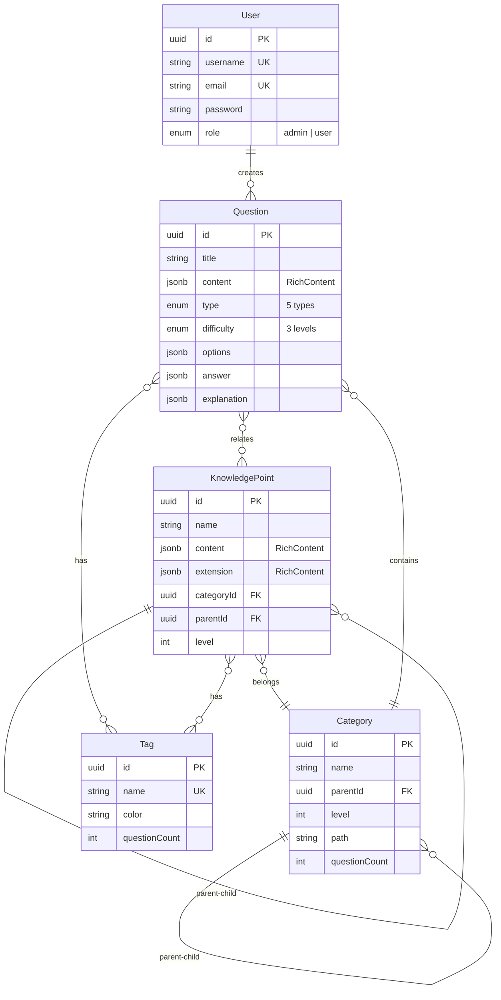
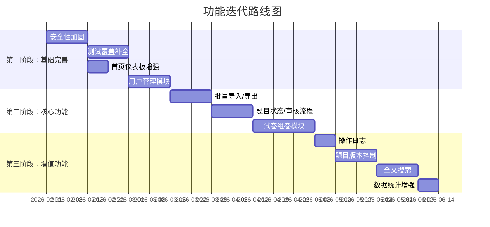

# 题目管理系统 - 分析与改进建议

> 分析日期：2026-02-15
> 涉及项目：`question-backend`（NestJS 后端）| `question-managing`（React 前端）

---

## 一、系统现状概览

### 技术栈

| 层级         | 技术选型                                                  |
| ------------ | --------------------------------------------------------- |
| **后端框架** | NestJS 10 + TypeORM + PostgreSQL                          |
| **认证**     | Passport + JWT（Access + Refresh Token）                  |
| **API 文档** | Swagger (OpenAPI)                                         |
| **文件上传** | GitHub 图床 + CDN 多级降级（Statically → GitHub → Proxy） |
| **前端框架** | React 19 + TypeScript + Vite 7                            |
| **UI 组件**  | Ant Design 6                                              |
| **状态管理** | Zustand（UI/筛选） + TanStack Query（服务端状态）         |
| **富文本**   | Tiptap 3 编辑器 + KaTeX 公式渲染                          |
| **容器化**   | Docker + docker-compose                                   |

### 已实现功能模块

| 模块       | 后端 | 前端 | 说明                                        |
| ---------- | :--: | :--: | ------------------------------------------- |
| 用户认证   |  ✅  |  ✅  | 注册/登录/刷新令牌/获取个人信息             |
| 题目 CRUD  |  ✅  |  ✅  | 创建/编辑/删除/分页查询/筛选                |
| 分类管理   |  ✅  |  ✅  | 树形结构（最多三级）                        |
| 标签管理   |  ✅  |  ✅  | 含颜色标识、题目数量统计                    |
| 知识点管理 |  ✅  |  ✅  | 树形结构 + 富文本 + 分类/标签关联           |
| 图片上传   |  ✅  |  ✅  | GitHub 图床 + CDN 健康监控 + 降级代理       |
| 公式处理   |  ✅  |  ✅  | LaTeX → 服务端渲染为图片（MathJax-node）    |
| 富文本编辑 |  ✅  |  ✅  | 原始内容（raw）+ 渲染内容（rendered）双存储 |

### 数据模型

### 题目类型支持

| 枚举值            | 说明   |
| ----------------- | ------ |
| `single_choice`   | 单选题 |
| `multiple_choice` | 多选题 |
| `true_false`      | 判断题 |
| `fill_blank`      | 填空题 |
| `short_answer`    | 简答题 |

---

## 二、建议新增的功能

### 🔥 高优先级

#### 1. 题目批量导入/导出

- **后端**：新增 `POST /questions/import` 和 `GET /questions/export` 接口
- 支持 Excel（xlsx）和 JSON 格式
- 导入时自动识别题型、自动匹配已有分类/标签
- 导出支持按筛选条件批量导出
- **前端**：新增导入/导出按钮和进度提示

#### 2. 试卷组卷模块

- 新增 `ExamPaper` 实体：标题、描述、题目列表（含排序和分值）、总分、时间限制
- 支持手动选题组卷和按策略自动组卷（按分类/难度/题型/知识点比例随机抽题）
- **前端**：试卷列表页 + 组卷编辑器 + 试卷预览

#### 3. 用户管理模块

- 目前后端有 `roles.guard.ts` 但缺少用户管理 API
- 新增：用户列表、角色分配、禁用/启用用户、修改密码
- **前端**：用户管理页面（仅管理员可见）

#### 4. 题目收藏/错题本

- 新增 `UserQuestionRelation` 实体，记录用户与题目的关系（收藏、标记已做、标记错误）
- 支持按用户维度查询收藏/错题列表

---

### ⭐ 中优先级

#### 5. 操作日志与审计

- 新增 `AuditLog` 实体，记录谁在何时做了什么操作
- 使用 NestJS Interceptor 自动记录 CRUD 操作
- **前端**：操作日志查看页面

#### 6. 题目版本控制

- 记录题目每次修改的历史版本，支持查看变更和回滚
- 使用 JSON Patch 或快照方式存储变更

#### 7. 数据统计仪表板增强

- 当前首页仅显示总数统计
- 增加：题目类型分布饼图、难度分布柱状图、每日新增趋势线图、分类题目数量排名、最近编辑记录
- 使用 Ant Design Charts 或 ECharts 实现

#### 8. 题目评论/备注

- 为题目添加评论功能，方便团队协作讨论
- 新增 `Comment` 实体关联题目和用户

#### 9. 题目状态管理

- 新增 `status` 字段：`draft`（草稿）、`reviewing`（审核中）、`published`（已发布）、`archived`（已归档）
- 支持审核工作流：创建者提交 → 审核者审批 → 发布

---

### 💡 低优先级

#### 10. 全文搜索

- 集成 PostgreSQL 全文搜索或 Elasticsearch
- 支持按题目内容、选项内容、解析内容搜索

#### 11. 题目去重检测

- 基于标题/内容相似度检测重复题目
- 创建新题时自动提示可能的重复题目

#### 12. API 接口缓存

- 使用 Redis 缓存热点查询（分类列表、标签列表等）
- 减少数据库压力，提升响应速度

#### 13. WebSocket 实时通知

- 当其他用户编辑同一题目时显示提醒
- 题目审核状态变更时推送通知

#### 14. 移动端/小程序

- 提供面向学生的答题端（微信小程序/H5）
- 支持刷题、做题记录、错题回顾

---

## 三、现有代码需完善的地方

### 🔴 安全性

| 问题                     | 位置                              | 建议                                                 |
| ------------------------ | --------------------------------- | ---------------------------------------------------- |
| JWT Secret 硬编码默认值  | `configuration.ts` L24            | 生产环境必须设置环境变量，启动时检查                 |
| CORS 配置过于宽松        | `main.ts` L32 `origin: true`      | 生产环境应限制为特定域名白名单                       |
| 缺少请求速率限制         | 全局                              | 集成 `@nestjs/throttler` 防止暴力破解和 DDoS         |
| 用户角色鉴权不完整       | `roles.guard.ts` 存在但未广泛使用 | 在管理类接口（删除、用户管理）上使用 `@Roles` 装饰器 |
| Refresh Token 未入库管理 | `auth.service.ts`                 | Token 应存储到数据库/Redis，支持主动吊销和单点登录   |

### 🟡 代码质量

| 问题                       | 位置                                                | 建议                                                         |
| -------------------------- | --------------------------------------------------- | ------------------------------------------------------------ |
| 测试覆盖不足               | 后端仅有 `test/` 目录空壳；前端有部分 Service 测试  | 补充核心 Service 单元测试和 E2E 测试                         |
| 分页 DTO 无边界校验        | 后端 `QueryQuestionDto`                             | 限制 `pageSize` 最大值（如 100），防止恶意大量查询           |
| 错误日志不完善             | 后端 `AllExceptionsFilter`                          | 集成结构化日志（如 Winston/Pino），记录请求上下文            |
| `RichContent` 接口重复定义 | `question.entity.ts` 和 `knowledge-point.entity.ts` | 提取到公共文件 `common/interfaces/rich-content.interface.ts` |
| 前端缺少 404 页面          | `router/index.tsx` 通配路由直接跳转首页             | 添加专用 404 页面提升用户体验                                |

### 🟠 架构与性能

| 问题                   | 位置                                | 建议                                                   |
| ---------------------- | ----------------------------------- | ------------------------------------------------------ |
| 数据库查询 N+1 问题    | `QuestionService.findAll` 加载关联  | 使用 `leftJoinAndSelect` 一次性加载、检查查询效率      |
| 缺少数据库索引         | `question.entity.ts`                | 为 `title`、`type`、`difficulty`、`createdAt` 添加索引 |
| 开发环境自动同步数据库 | `app.module.ts` `synchronize: true` | 即使开发环境也建议使用 migration，避免数据丢失         |
| 前端缺少 ErrorBoundary | 全局                                | 添加 React ErrorBoundary 捕获渲染错误                  |
| 图片上传无压缩预处理   | `upload.controller.ts`              | 后端已引入 `sharp`，确认是否启用了图片压缩/WebP 转换   |
| 缺少 Health Check 端点 | 后端全局                            | 新增 `GET /health` 接口，用于容器编排和监控            |

### 🔵 前端体验

| 问题               | 位置            | 建议                                                   |
| ------------------ | --------------- | ------------------------------------------------------ |
| 首页过于简单       | `pages/Home`    | 增加数据图表、快捷入口、最近操作记录                   |
| 列表未支持排序     | `QuestionTable` | 支持按创建时间、更新时间、难度等排序                   |
| 缺少面包屑导航     | `MainLayout`    | 添加面包屑提示当前页面层级                             |
| 缺少暗色主题       | 全局            | 使用 Ant Design 的 `theme.algorithm` 支持暗色模式切换  |
| 表单未保存离开提示 | `QuestionForm`  | 添加 `beforeunload` 事件和路由守卫，防止误退出丢失编辑 |
| 缺少批量操作       | `QuestionList`  | 支持批量删除、批量修改分类/标签                        |
| 无国际化支持       | 全局            | 如有多语言需求，集成 `react-i18next`                   |

---

## 四、改进优先级路线图

---

## 五、总结

当前系统已具备**完整的题目管理核心功能**，包括 CRUD、分类/标签/知识点的多维度组织、富文本与 LaTeX 公式支持、JWT 认证、以及自建 CDN 图床系统。代码结构清晰，前后端分离规范，技术选型现代化。

**重点改进方向**：

1. **安全加固** — 生产环境安全配置是最紧迫的任务
2. **功能扩展** — 批量导入/导出和试卷组卷是最有价值的新功能
3. **体验优化** — 仪表板增强和前端交互细节提升用户满意度
4. **代码健壮性** — 测试覆盖和错误处理是长期维护的保障
