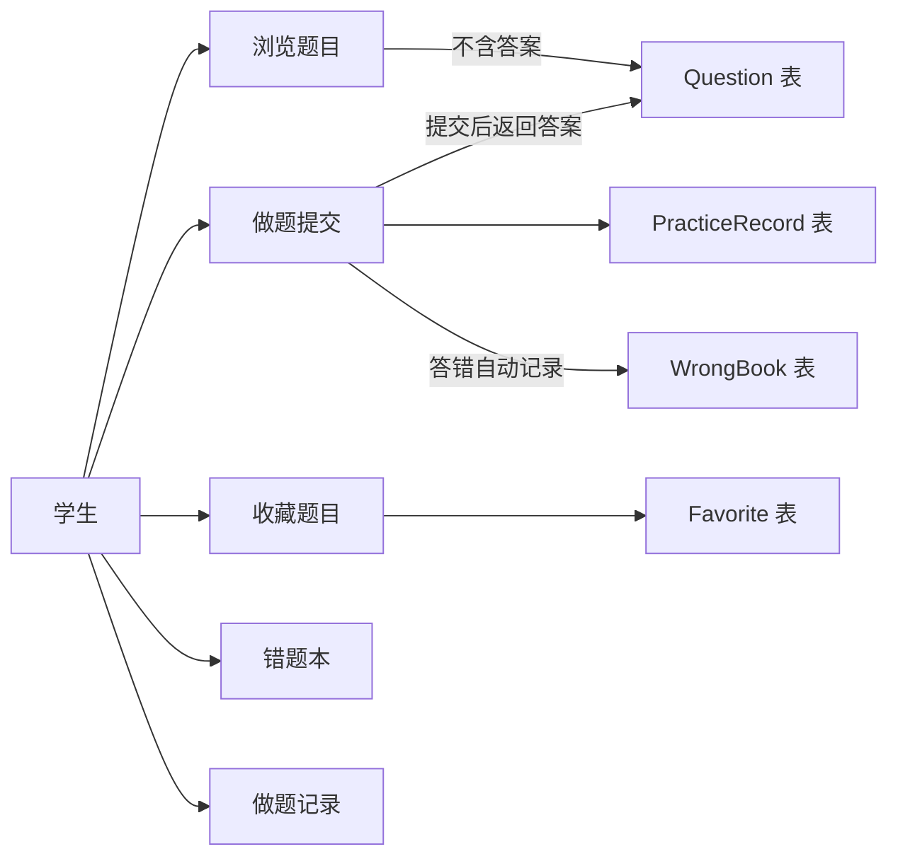
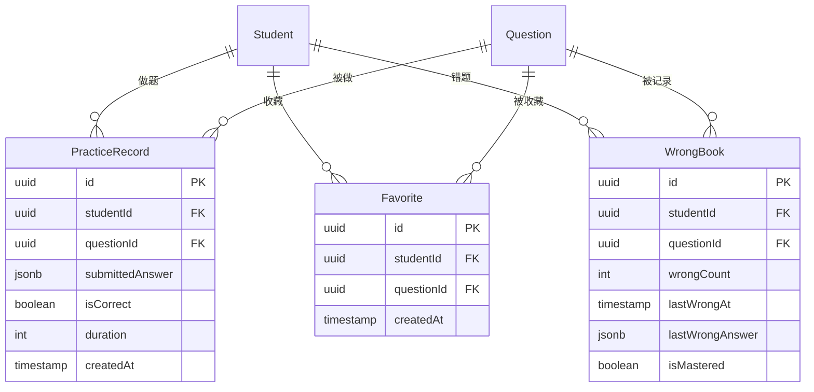

# 学生端题目 API - 开发文档

> 编写日期：2026-02-15  
> 前置依赖：用户管理模块（User + Student 双用户体系）  
> 模块定位：面向学生的刷题、做题、收藏、错题本功能

---

## 一、功能概览



### 与管理端 API 的核心差异

| 维度         | 管理端 `GET /api/questions/:id` | 学生端 `GET /api/student/questions/:id` |
| ------------ | :-----------------------------: | :-------------------------------------: |
| 答案         |           ✅ 始终返回           |        ❌ **隐藏**，提交后才返回        |
| 解析         |           ✅ 始终返回           |        ❌ **隐藏**，提交后才返回        |
| 内容格式     |         raw + rendered          |               仅 rendered               |
| creator 信息 |             ✅ 返回             |                ❌ 不返回                |
| 权限         |      `@UserType('admin')`       |         `@UserType('student')`          |

---

## 二、数据库设计（新增实体）

### PracticeRecord（做题记录）

```typescript
@Entity("practice_records")
export class PracticeRecord {
  @PrimaryGeneratedColumn("uuid")
  id: string;

  /** 学生 */
  @ManyToOne(() => Student, { onDelete: "CASCADE" })
  @JoinColumn({ name: "studentId" })
  student: Student;

  @Column()
  studentId: string;

  /** 题目 */
  @ManyToOne(() => Question, { onDelete: "CASCADE" })
  @JoinColumn({ name: "questionId" })
  question: Question;

  @Column()
  questionId: string;

  /** 学生提交的答案 */
  @Column({ type: "jsonb" })
  submittedAnswer: any;
  // 单选: "A"
  // 多选: ["A", "C"]
  // 判断: true/false
  // 填空: ["答案1", "答案2"]
  // 简答: "文本内容"

  /** 是否正确 */
  @Column()
  isCorrect: boolean;

  /** 做题用时（秒） */
  @Column({ default: 0 })
  duration: number;

  @CreateDateColumn()
  createdAt: Date;
}
```

### Favorite（收藏）

```typescript
@Entity("favorites")
@Unique(["studentId", "questionId"]) // 联合唯一
export class Favorite {
  @PrimaryGeneratedColumn("uuid")
  id: string;

  @ManyToOne(() => Student, { onDelete: "CASCADE" })
  @JoinColumn({ name: "studentId" })
  student: Student;

  @Column()
  studentId: string;

  @ManyToOne(() => Question, { onDelete: "CASCADE" })
  @JoinColumn({ name: "questionId" })
  question: Question;

  @Column()
  questionId: string;

  @CreateDateColumn()
  createdAt: Date;
}
```

### WrongBook（错题本）

```typescript
@Entity("wrong_book")
@Unique(["studentId", "questionId"]) // 联合唯一
export class WrongBook {
  @PrimaryGeneratedColumn("uuid")
  id: string;

  @ManyToOne(() => Student, { onDelete: "CASCADE" })
  @JoinColumn({ name: "studentId" })
  student: Student;

  @Column()
  studentId: string;

  @ManyToOne(() => Question, { onDelete: "CASCADE" })
  @JoinColumn({ name: "questionId" })
  question: Question;

  @Column()
  questionId: string;

  /** 错误次数 */
  @Column({ default: 1 })
  wrongCount: number;

  /** 最近一次错误时间 */
  @Column({ type: "timestamp" })
  lastWrongAt: Date;

  /** 最近一次提交的错误答案 */
  @Column({ type: "jsonb" })
  lastWrongAnswer: any;

  /** 是否已掌握（学生手动标记） */
  @Column({ default: false })
  isMastered: boolean;

  @CreateDateColumn()
  createdAt: Date;

  @UpdateDateColumn()
  updatedAt: Date;
}
```

### ER 关系图



---

## 三、API 设计

### 3.1 题目浏览

| 方法  | 路径                         | 说明                                |
| ----- | ---------------------------- | ----------------------------------- |
| `GET` | `/api/student/questions`     | 题目列表（分页，**不含答案/解析**） |
| `GET` | `/api/student/questions/:id` | 题目详情（**不含答案/解析**）       |

**GET /student/questions 查询参数：**

```typescript
class StudentQueryQuestionDto extends PaginationQueryDto {
  keyword?: string; // 搜索标题
  categoryId?: string; // 分类筛选
  type?: QuestionType; // 题型筛选
  difficulty?: DifficultyLevel; // 难度筛选
  tagIds?: string[]; // 标签筛选
  knowledgePointIds?: string[]; // 知识点筛选
}
```

**响应字段排除逻辑：**

```typescript
// 返回的题目数据中排除以下字段：
{
  id, title, content, type, difficulty,
  category, tags, knowledgePoints,
  options: options?.map(o => ({
    label: o.label,
    content: o.content,
    // ❌ 不返回 o.isCorrect
  })),
  // ❌ 不返回 answer
  // ❌ 不返回 explanation
  // ❌ 不返回 creator
}
```

### 3.2 做题提交

| 方法   | 路径                                | 说明     |
| ------ | ----------------------------------- | -------- |
| `POST` | `/api/student/questions/:id/submit` | 提交答案 |

**请求体：**

```typescript
class SubmitAnswerDto {
  answer: any; // 同 PracticeRecord.submittedAnswer 格式
  duration?: number; // 做题用时（秒）
}
```

**响应体：**

```typescript
{
  isCorrect: boolean;           // 是否正确
  correctAnswer: any;           // 正确答案
  explanation: RichContent;     // 解析
  options?: Option[];           // 完整选项（含 isCorrect）
  practiceRecordId: string;     // 做题记录 ID
}
```

**后端处理逻辑：**

```
1. 查询题目（含答案）
2. 自动判题（对比 submittedAnswer 和正确答案）
3. 写入 PracticeRecord
4. 如果答错 → 写入或更新 WrongBook（wrongCount++）
5. 返回结果 + 答案 + 解析
```

**判题规则：**

```
单选题：submittedAnswer === correctAnswer
多选题：排序后逐一比较
判断题：submittedAnswer === correctAnswer (boolean)
填空题：逐个空比较（忽略前后空格）
简答题：isCorrect = null（标记为需人工评阅或直接返回参考答案）
```

### 3.3 收藏

| 方法   | 路径                                  | 说明                           |
| ------ | ------------------------------------- | ------------------------------ |
| `POST` | `/api/student/questions/:id/favorite` | 收藏（toggle，已收藏则取消）   |
| `GET`  | `/api/student/favorites`              | 收藏列表（分页，**不含答案**） |

### 3.4 错题本

| 方法     | 路径                                 | 说明                             |
| -------- | ------------------------------------ | -------------------------------- |
| `GET`    | `/api/student/wrong-book`            | 错题列表（分页，含最近错误答案） |
| `PATCH`  | `/api/student/wrong-book/:id/master` | 标记已掌握/未掌握                |
| `DELETE` | `/api/student/wrong-book/:id`        | 从错题本移除                     |

### 3.5 做题记录与统计

| 方法  | 路径                            | 说明             |
| ----- | ------------------------------- | ---------------- |
| `GET` | `/api/student/practice-records` | 做题记录（分页） |
| `GET` | `/api/student/statistics`       | 做题统计概览     |

**统计响应体：**

```typescript
{
  totalPracticed: number; // 总做题数
  totalCorrect: number; // 总正确数
  correctRate: number; // 正确率（0~1）
  totalFavorites: number; // 收藏数
  totalWrong: number; // 错题数
  todayPracticed: number; // 今日做题数
  todayCorrect: number; // 今日正确数
  weeklyTrend: {
    // 近7天趋势
    date: string;
    practiced: number;
    correct: number;
  }
  [];
}
```

---

## 四、所有接口权限

> 以下所有接口需要 `@UserType('student')` 守卫，只有学生端 JWT 才能访问。

```typescript
@ApiTags('student-questions')
@ApiBearerAuth('JWT-auth')
@Controller('student')
@UserType('student')  // 整个 Controller 限定学生端
export class StudentQuestionController { ... }
```

---

## 五、后端文件清单

### 新增文件

| 文件                                                          | 用途         |
| ------------------------------------------------------------- | ------------ |
| **实体**                                                      |              |
| `modules/student-question/entities/practice-record.entity.ts` | 做题记录实体 |
| `modules/student-question/entities/favorite.entity.ts`        | 收藏实体     |
| `modules/student-question/entities/wrong-book.entity.ts`      | 错题本实体   |
| **模块/服务/控制器**                                          |              |
| `modules/student-question/student-question.module.ts`         | 模块定义     |
| `modules/student-question/student-question.controller.ts`     | 路由控制器   |
| `modules/student-question/student-question.service.ts`        | 业务逻辑     |
| `modules/student-question/student-statistics.service.ts`      | 统计相关逻辑 |
| **DTO**                                                       |              |
| `modules/student-question/dto/student-query-question.dto.ts`  | 题目查询 DTO |
| `modules/student-question/dto/submit-answer.dto.ts`           | 提交答案 DTO |
| `modules/student-question/dto/query-practice-record.dto.ts`   | 记录查询 DTO |
| `modules/student-question/dto/query-favorite.dto.ts`          | 收藏查询 DTO |
| `modules/student-question/dto/query-wrong-book.dto.ts`        | 错题查询 DTO |
| `modules/student-question/dto/index.ts`                       | 导出         |
| **测试**                                                      |              |
| `modules/student-question/student-question.service.spec.ts`   | 单元测试     |

### 修改文件

| 文件                                           | 变更内容                                   |
| ---------------------------------------------- | ------------------------------------------ |
| `app.module.ts`                                | 导入 `StudentQuestionModule`               |
| `modules/question/entities/question.entity.ts` | 添加 favorites/wrongBooks 反向关系（可选） |

---

## 六、核心业务逻辑要点

### 6.1 答案隐藏策略

```typescript
// student-question.service.ts
private sanitizeQuestion(question: Question) {
  // 移除答案和解析
  const { answer, explanation, creator, ...safe } = question as any;

  // 移除选项中的 isCorrect
  if (safe.options) {
    safe.options = safe.options.map(({ isCorrect, ...opt }) => opt);
  }

  // 只返回 rendered 内容
  if (safe.content?.rendered) {
    safe.content = { rendered: safe.content.rendered };
  }

  return safe;
}
```

### 6.2 自动判题

```typescript
private judgeAnswer(question: Question, submitted: any): boolean {
  switch (question.type) {
    case QuestionType.SINGLE_CHOICE:
      return submitted === question.answer;

    case QuestionType.MULTIPLE_CHOICE:
      const correct = [...question.answer].sort();
      const student = [...submitted].sort();
      return JSON.stringify(correct) === JSON.stringify(student);

    case QuestionType.TRUE_FALSE:
      return submitted === question.answer;

    case QuestionType.FILL_BLANK:
      // 逐空比较，忽略空格
      return question.answer.every((a, i) =>
        a.trim().toLowerCase() === submitted[i]?.trim()?.toLowerCase()
      );

    case QuestionType.SHORT_ANSWER:
      return null; // 简答题不自动判，返回参考答案
  }
}
```

### 6.3 错题本自动记录

```typescript
// 在 submit 方法中
if (!isCorrect) {
  const existing = await this.wrongBookRepo.findOne({
    where: { studentId, questionId },
  });

  if (existing) {
    existing.wrongCount++;
    existing.lastWrongAt = new Date();
    existing.lastWrongAnswer = submitted;
    existing.isMastered = false; // 重新标记为未掌握
    await this.wrongBookRepo.save(existing);
  } else {
    await this.wrongBookRepo.save({
      studentId,
      questionId,
      lastWrongAt: new Date(),
      lastWrongAnswer: submitted,
    });
  }
}
```

---

## 七、验证计划

### 7.1 后端单元测试

```bash
cd d:\desktop\program\A_top\NebulaStudyNexusBackend\question-backend
npm run test -- --testPathPattern="student-question.service.spec"
```

测试覆盖：

- 题目列表查询（验证答案字段被排除）
- 题目详情（验证答案字段被排除）
- 提交答案（单选/多选/判断/填空各一个用例）
- 自动判题正确性
- 错题本自动记录（答错写入、多次答错 count++）
- 收藏 toggle（收藏/取消收藏）
- 统计数据计算

### 7.2 Swagger API 手动测试

```
1. cd question-backend && npm run start:dev
2. 打开 http://localhost:3000/api/docs

准备工作：
3. 用管理端创建几道不同类型的题目
4. 用学生账号 Token 访问以下接口：

浏览题目：
5. GET /api/student/questions → 验证返回列表不含 answer/explanation
6. GET /api/student/questions/:id → 验证详情不含 answer/explanation

做题提交：
7. POST /api/student/questions/:id/submit → 提交正确答案 → isCorrect=true
8. POST /api/student/questions/:id/submit → 提交错误答案 → isCorrect=false + 错题本自动记录

收藏：
9. POST /api/student/questions/:id/favorite → 收藏
10. POST /api/student/questions/:id/favorite → 再次调用 → 取消收藏
11. GET /api/student/favorites → 验证收藏列表

错题本：
12. GET /api/student/wrong-book → 验证错题列表
13. PATCH /api/student/wrong-book/:id/master → 标记已掌握

统计：
14. GET /api/student/statistics → 验证统计数据
```

---

## 八、实施顺序

```
第 1 步：创建 PracticeRecord / Favorite / WrongBook 三个实体
第 2 步：创建所有 DTO
第 3 步：StudentQuestionService — 题目查询（答案排除）
第 4 步：StudentQuestionService — 提交答案 + 自动判题 + 错题记录
第 5 步：StudentQuestionService — 收藏 toggle
第 6 步：StudentStatisticsService — 统计
第 7 步：StudentQuestionController — 所有路由
第 8 步：单元测试 + Swagger 验证
```

> [!NOTE]
> 此模块依赖用户管理模块中的 `Student` 实体和 `@UserType('student')` 守卫，需先完成用户管理模块的开发。
