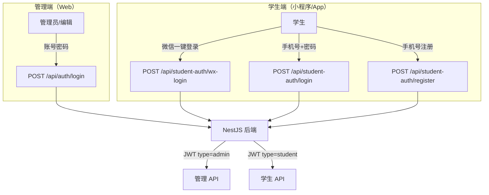
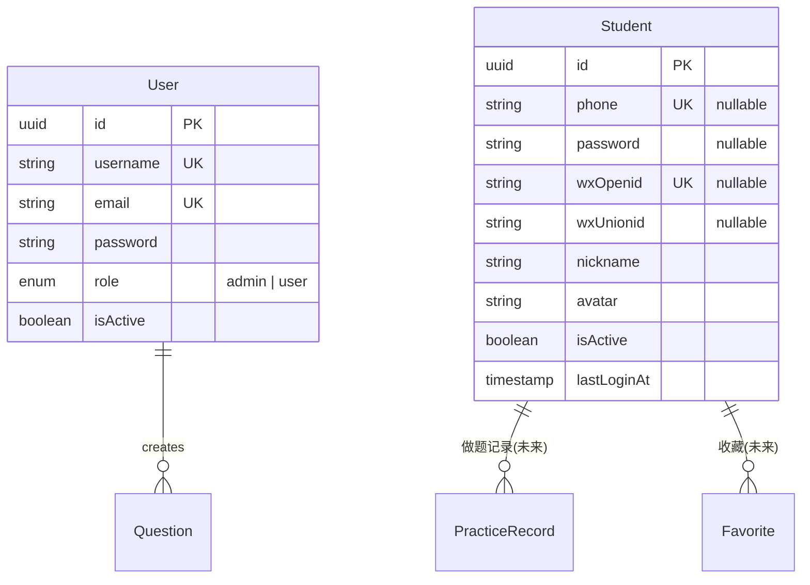
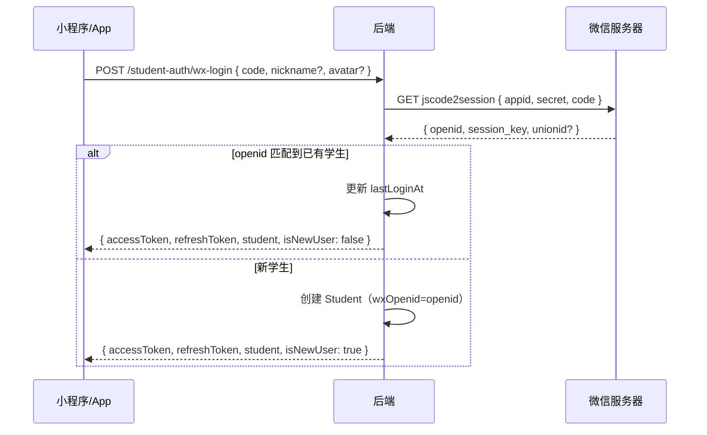
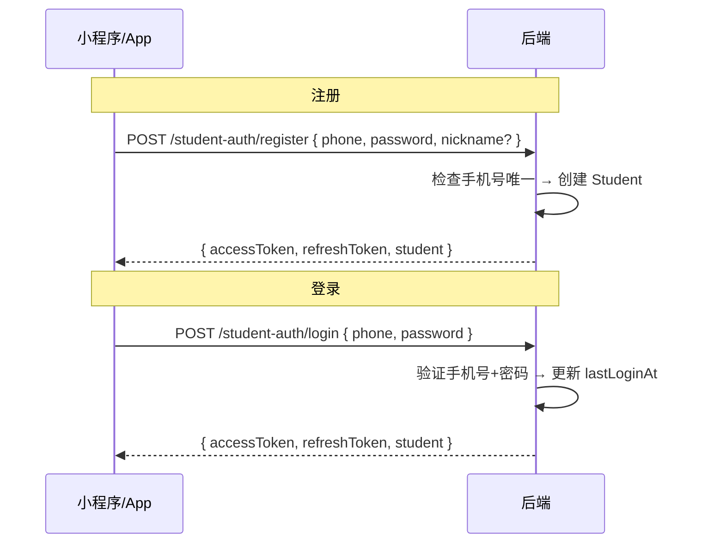

# 用户管理模块 - 开发文档（终稿）

> 编写日期：2026-02-15  
> 架构：双用户表（管理端 User + 学生端 Student），完全分离

---

## 一、架构总览

### 双用户体系



| 用户类型    | 实体      | 登录方式                  | 客户端     | JWT type  |
| ----------- | --------- | ------------------------- | ---------- | --------- |
| 管理员/编辑 | `User`    | 账号密码                  | Web 管理端 | `admin`   |
| 学生        | `Student` | 微信一键登录 + 手机号密码 | 小程序/App | `student` |

> [!IMPORTANT]
> 两套用户系统完全独立：独立的实体、独立的 Service、独立的 Controller、独立的认证路由前缀。API 守卫通过 JWT payload 中的 `type` 字段区分。

---

## 二、数据库设计

### User 实体变更（管理端员工）

```diff
 @Entity('users')
 export class User {
   // ...已有字段保持不变（id, username, email, password, role）

+  @Column({ default: true })
+  isActive: boolean;
 }
```

> 仅新增 `isActive` 字段用于启用/禁用管理员账号。

### Student 实体（新建）

```typescript
@Entity("students")
export class Student {
  @PrimaryGeneratedColumn("uuid")
  id: string;

  /** 手机号（唯一，用于手机号登录） */
  @Column({ length: 20, unique: true, nullable: true })
  phone: string | null;

  /** 密码（手机号注册时设置） */
  @Column({ nullable: true })
  @Exclude()
  password: string | null;

  /** 微信 openid（唯一，用于微信登录） */
  @Column({ length: 100, unique: true, nullable: true })
  wxOpenid: string | null;

  /** 微信 unionid（跨应用关联） */
  @Column({ length: 100, nullable: true })
  wxUnionid: string | null;

  /** 昵称 */
  @Column({ length: 100, default: "" })
  nickname: string;

  /** 头像 URL */
  @Column({ length: 500, default: "" })
  avatar: string;

  /** 账号是否启用 */
  @Column({ default: true })
  isActive: boolean;

  /** 最后登录时间 */
  @Column({ type: "timestamp", nullable: true })
  lastLoginAt: Date | null;

  @CreateDateColumn()
  createdAt: Date;

  @UpdateDateColumn()
  updatedAt: Date;

  // --- 方法 ---

  @BeforeInsert()
  @BeforeUpdate()
  async hashPassword() {
    /* 同 User 实体逻辑 */
  }

  async validatePassword(plain: string): Promise<boolean> {
    /* bcrypt.compare */
  }
}
```

### ER 关系图



> [!NOTE]
> Student 的 `phone` 和 `wxOpenid` 都是 nullable 且 unique。至少有一个不为空（手机号注册 or 微信登录）。微信用户后续可绑定手机号。

---

## 三、后端 API 设计

### 3.1 管理端认证（保留现有 + 扩展）

| 方法    | 路径                 | 权限   | 说明                       |
| ------- | -------------------- | ------ | -------------------------- |
| `POST`  | `/api/auth/login`    | Public | 管理员账号密码登录（已有） |
| `POST`  | `/api/auth/register` | Public | 管理员注册（已有）         |
| `POST`  | `/api/auth/refresh`  | Public | 刷新令牌（已有）           |
| `GET`   | `/api/auth/profile`  | Admin  | 获取个人信息（已有）       |
| `PATCH` | `/api/auth/profile`  | Admin  | **新增** - 修改个人信息    |
| `PATCH` | `/api/auth/password` | Admin  | **新增** - 修改自己的密码  |

### 3.2 学生端认证（全部新增）

| 方法    | 路径                            | 权限    | 说明               |
| ------- | ------------------------------- | ------- | ------------------ |
| `POST`  | `/api/student-auth/wx-login`    | Public  | 微信一键登录       |
| `POST`  | `/api/student-auth/register`    | Public  | 手机号 + 密码注册  |
| `POST`  | `/api/student-auth/login`       | Public  | 手机号 + 密码登录  |
| `POST`  | `/api/student-auth/refresh`     | Public  | 刷新令牌           |
| `GET`   | `/api/student-auth/profile`     | Student | 获取个人信息       |
| `PATCH` | `/api/student-auth/profile`     | Student | 修改昵称/头像      |
| `PATCH` | `/api/student-auth/password`    | Student | 修改密码           |
| `PATCH` | `/api/student-auth/bind-phone`  | Student | 微信用户绑定手机号 |
| `PATCH` | `/api/student-auth/bind-wechat` | Student | 手机号用户绑定微信 |

### 3.3 用户管理（Admin 后台操作）

| 方法         | 路径                            | 权限  | 说明                       |
| ------------ | ------------------------------- | ----- | -------------------------- |
| **员工管理** |                                 |       |                            |
| `GET`        | `/api/users`                    | Admin | 员工列表（分页+搜索+筛选） |
| `GET`        | `/api/users/:id`                | Admin | 员工详情                   |
| `PATCH`      | `/api/users/:id/role`           | Admin | 修改角色                   |
| `PATCH`      | `/api/users/:id/status`         | Admin | 启用/禁用                  |
| `PATCH`      | `/api/users/:id/reset-password` | Admin | 重置密码                   |
| `DELETE`     | `/api/users/:id`                | Admin | 删除员工                   |
| **学生管理** |                                 |       |                            |
| `GET`        | `/api/students`                 | Admin | 学生列表（分页+搜索+筛选） |
| `GET`        | `/api/students/:id`             | Admin | 学生详情                   |
| `PATCH`      | `/api/students/:id/status`      | Admin | 启用/禁用学生              |
| `DELETE`     | `/api/students/:id`             | Admin | 删除学生                   |

---

### 3.4 微信登录流程



### 3.5 手机号登录流程



---

## 四、JWT 策略改造

### 当前 JWT Payload

```typescript
// 现有
interface JwtPayload {
  sub: string; // 用户 ID
  username: string;
  role: string;
}
```

### 改造后

```typescript
// 管理端
interface AdminJwtPayload {
  sub: string; // User.id
  type: "admin";
  username: string;
  role: UserRole; // admin | user
}

// 学生端
interface StudentJwtPayload {
  sub: string; // Student.id
  type: "student";
  nickname: string;
}

type JwtPayload = AdminJwtPayload | StudentJwtPayload;
```

### 守卫改造

```typescript
// 新增 @UserType() 装饰器
@UserType('admin')   // 仅允许管理端用户
@UserType('student') // 仅允许学生端用户
// 不加则允许所有已认证用户
```

JwtStrategy 解析时会根据 `type` 字段查询对应的表（User 或 Student），验证用户存在且 `isActive === true`。

---

## 五、后端文件变更清单

### 新增文件

| 文件                                                      | 用途                             |
| --------------------------------------------------------- | -------------------------------- |
| **Student 模块**                                          |                                  |
| `modules/student/entities/student.entity.ts`              | Student 实体                     |
| `modules/student/student.module.ts`                       | Student 模块定义                 |
| `modules/student/student.service.ts`                      | Student Service                  |
| `modules/student/student.controller.ts`                   | Student 管理 Controller（Admin） |
| `modules/student/dto/query-student.dto.ts`                | 学生列表查询 DTO                 |
| `modules/student/dto/update-student-status.dto.ts`        | 启用/禁用 DTO                    |
| `modules/student/dto/index.ts`                            | DTO 导出                         |
| **学生端认证**                                            |                                  |
| `modules/student-auth/student-auth.module.ts`             | 学生认证模块                     |
| `modules/student-auth/student-auth.controller.ts`         | 学生认证 Controller              |
| `modules/student-auth/student-auth.service.ts`            | 学生认证 Service                 |
| `modules/student-auth/dto/wx-login.dto.ts`                | 微信登录 DTO                     |
| `modules/student-auth/dto/student-register.dto.ts`        | 手机号注册 DTO                   |
| `modules/student-auth/dto/student-login.dto.ts`           | 手机号登录 DTO                   |
| `modules/student-auth/dto/update-student-profile.dto.ts`  | 修改个人信息 DTO                 |
| `modules/student-auth/dto/change-student-password.dto.ts` | 修改密码 DTO                     |
| `modules/student-auth/dto/bind-phone.dto.ts`              | 绑定手机号 DTO                   |
| `modules/student-auth/dto/bind-wechat.dto.ts`             | 绑定微信 DTO                     |
| `modules/student-auth/dto/index.ts`                       | DTO 导出                         |
| **User 管理**                                             |                                  |
| `modules/user/user.controller.ts`                         | 员工管理 Controller（Admin）     |
| `modules/user/dto/query-user.dto.ts`                      | 员工列表查询 DTO                 |
| `modules/user/dto/update-user-role.dto.ts`                | 修改角色 DTO                     |
| `modules/user/dto/update-user-status.dto.ts`              | 启用/禁用 DTO                    |
| `modules/user/dto/reset-password.dto.ts`                  | 重置密码 DTO                     |
| **公共**                                                  |                                  |
| `common/decorators/user-type.decorator.ts`                | @UserType 装饰器                 |
| `common/guards/user-type.guard.ts`                        | UserType 守卫                    |
| **测试**                                                  |                                  |
| `modules/user/user.service.spec.ts`                       | User Service 单元测试            |
| `modules/student/student.service.spec.ts`                 | Student Service 单元测试         |

### 修改文件

| 文件                                          | 变更内容                                                               |
| --------------------------------------------- | ---------------------------------------------------------------------- |
| `modules/user/entities/user.entity.ts`        | 新增 `isActive` 字段                                                   |
| `modules/user/user.service.ts`                | 新增 findAllPaginated, updateRole, updateStatus, resetPassword, remove |
| `modules/user/user.module.ts`                 | 添加 UserController                                                    |
| `modules/user/dto/index.ts`                   | 导出新 DTO                                                             |
| `modules/auth/auth.controller.ts`             | 新增 updateProfile, changePassword                                     |
| `modules/auth/auth.service.ts`                | 新增对应逻辑                                                           |
| `modules/auth/strategies/jwt.strategy.ts`     | 改造为支持双 type 的 payload                                           |
| `common/decorators/current-user.decorator.ts` | 更新 JwtPayload 类型                                                   |
| `app.module.ts`                               | 导入 StudentModule, StudentAuthModule, 注册 RolesGuard                 |
| `config/configuration.ts`                     | 新增 wechat.appid, wechat.secret                                       |
| `.env.example`                                | 新增 WECHAT_APPID, WECHAT_APP_SECRET                                   |

---

## 六、前端文件变更清单（Web 管理端）

### 新增文件

| 文件                                   | 用途                  |
| -------------------------------------- | --------------------- |
| `services/userService.ts`              | 员工管理 API          |
| `services/studentService.ts`           | 学生管理 API          |
| `hooks/useUsers.ts`                    | 员工列表 Hook         |
| `hooks/useStudents.ts`                 | 学生列表 Hook         |
| `pages/UserManage/index.tsx`           | 员工管理页面          |
| `pages/StudentManage/index.tsx`        | 学生管理页面          |
| `components/user/UserTable.tsx`        | 员工表格              |
| `components/user/UserFilter.tsx`       | 员工筛选栏            |
| `components/user/UserFormModal.tsx`    | 角色修改/密码重置弹窗 |
| `components/student/StudentTable.tsx`  | 学生表格              |
| `components/student/StudentFilter.tsx` | 学生筛选栏            |

### 修改文件

| 文件                               | 变更内容                                                     |
| ---------------------------------- | ------------------------------------------------------------ |
| `router/index.tsx`                 | 新增 `/users` 和 `/students` 路由                            |
| `components/layout/MainLayout.tsx` | 侧边栏新增"员工管理"+"学生管理"（仅 admin 可见）             |
| `types/index.ts`                   | 新增 UserInfo, StudentInfo, UserFilters, StudentFilters 类型 |

---

## 七、安全要点

```
1. 管理员不能操作自己 → Service 检查 currentUserId !== targetId
2. /users/* 和 /students/* 管理接口 → @Roles(UserRole.ADMIN)
3. 学生 API 只能操作自己 → @UserType('student') + sub === targetId
4. 微信登录频率限制 → 防 code 枚举
5. 手机号格式校验 → @Matches(/^1[3-9]\d{9}$/)
6. 密码最少 6 位 → @MinLength(6)
7. 被禁用的学生/员工 JWT 也要在 Strategy 层拦截（查表校验 isActive）
8. 微信 AppID 未配置时 → wx-login 接口返回 503
```

---

## 八、配置项

```bash
# .env.example 新增
WECHAT_APPID=           # 微信小程序 AppID
WECHAT_APP_SECRET=      # 微信小程序 AppSecret
```

```typescript
// config/configuration.ts 新增
wechat: {
  appid: process.env.WECHAT_APPID || '',
  secret: process.env.WECHAT_APP_SECRET || '',
},
```

---

## 九、验证计划

### 9.1 后端单元测试

```bash
cd d:\desktop\program\A_top\NebulaStudyNexusBackend\question-backend
npm run test -- --testPathPattern="user.service.spec"
npm run test -- --testPathPattern="student.service.spec"
```

**User Service 测试覆盖：**

- findAllPaginated — 分页、关键词搜索、角色筛选、状态筛选
- updateRole — 正常修改、禁止修改自己
- updateStatus — 正常切换、禁止禁用自己
- resetPassword — 正常重置、禁止重置自己
- remove — 正常删除、禁止删除自己

**Student Service 测试覆盖：**

- findByWxOpenid / findByPhone — 查找学生
- createWxStudent — 微信用户创建
- createPhoneStudent — 手机号注册
- validatePhoneLogin — 手机号+密码验证
- updateStatus — 启用/禁用
- bindPhone / bindWechat — 绑定逻辑、重复绑定校验

### 9.2 Swagger API 手动测试

```
1. cd question-backend && npm run start:dev
2. 打开 http://localhost:3000/api/docs

管理端测试：
3. POST /api/auth/login → 管理员登录获取 JWT
4. GET /api/users → 员工列表分页
5. PATCH /api/users/:id/role → 修改角色
6. PATCH /api/users/:id/status → 禁用/启用
7. GET /api/students → 学生列表
8. PATCH /api/students/:id/status → 禁用学生
9. 用普通用户 Token 访问管理接口 → 403

学生端测试：
10. POST /api/student-auth/register → 手机号注册
11. POST /api/student-auth/login → 手机号登录
12. GET /api/student-auth/profile → 获取学生信息
13. PATCH /api/student-auth/profile → 修改昵称
14. PATCH /api/student-auth/password → 修改密码
15. 微信登录需配置 AppID 后测试，未配置返回 503
```

### 9.3 前端功能验证

```
1. cd question-managing && npm run dev
2. 管理员登录 → 侧边栏看到"员工管理"+"学生管理"
3. 员工管理页：搜索/筛选/角色修改/禁用/重置密码/删除
4. 学生管理页：搜索/筛选/禁用/删除
5. 普通用户登录 → 侧边栏无以上菜单
```

---

## 十、实施顺序

```
第 1 步：后端 — User 实体加 isActive + Student 实体创建
第 2 步：后端 — 所有 DTO 创建
第 3 步：后端 — UserService 扩展 + StudentService 创建
第 4 步：后端 — UserController + StudentController（Admin 管理）
第 5 步：后端 — JWT 策略改造 + @UserType 守卫 + RolesGuard 全局注册
第 6 步：后端 — StudentAuthController + StudentAuthService（微信+手机号登录）
第 7 步：后端 — AuthController 扩展（个人信息/密码管理）
第 8 步：后端 — 配置项 + 单元测试 + Swagger 验证
第 9 步：前端 — Service + Hook 层
第10步：前端 — 员工管理/学生管理页面 + 组件
第11步：前端 — 路由/菜单/权限控制
第12步：联调测试
```
