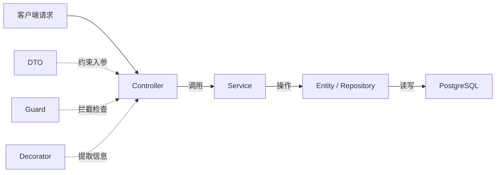
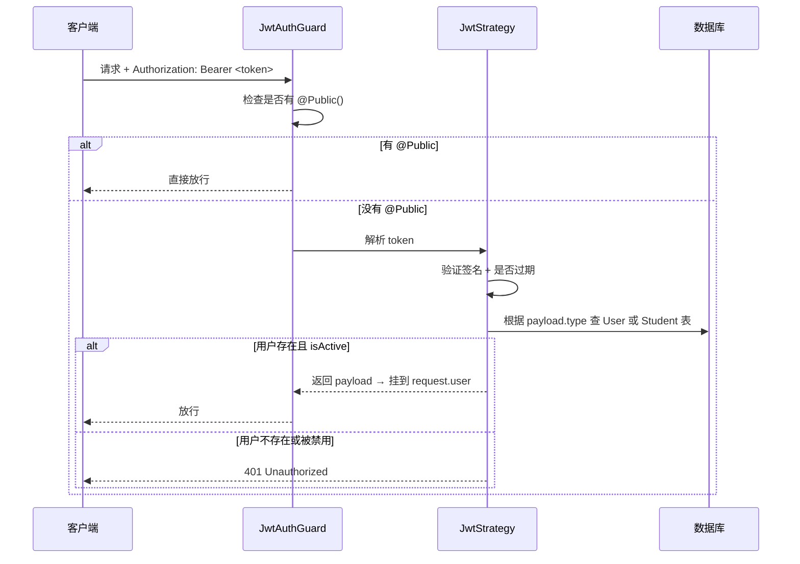

# 用户管理模块 - 概念讲解

> 配合 `user-module-guide-backend.md` 和 `user-module-guide-frontend.md` 阅读  
> 解释每一个文件和模块的作用，帮助理解 NestJS + React 的开发模式

---

## 一、NestJS 核心概念回顾

在讲解每个文件前，先理清 NestJS 模块化架构中每种文件的职责：



| 概念           | 类比                       | 职责                                                          |
| -------------- | -------------------------- | ------------------------------------------------------------- |
| **Module**     | 文件夹 / 包                | 把相关的 Controller、Service、Entity 打包在一起，声明依赖关系 |
| **Entity**     | 数据库表的 TypeScript 映射 | 定义字段、类型、关系，TypeORM 据此建表                        |
| **DTO**        | 请求参数的"合同"           | 定义 API 接收什么字段、什么格式，自动校验不合法的请求         |
| **Service**    | 业务逻辑层                 | 所有"怎么做"的逻辑都写在这里（查数据库、判断权限、算结果）    |
| **Controller** | 路由入口                   | 定义 URL 路径和 HTTP 方法，接收请求、调 Service、返回结果     |
| **Guard**      | 门卫                       | 在请求到达 Controller 前拦截，检查"你有没有资格进来"          |
| **Decorator**  | 标签 / 注解                | 给方法或参数贴标签，附加元数据或提取信息                      |
| **Strategy**   | 认证策略                   | Passport.js 的概念，定义"怎么验证用户身份"                    |

---

## 二、后端每个文件的作用

### Step 1 — 实体层

#### `user.entity.ts` 新增 `isActive` 字段

```
为什么需要？
→ 管理员需要"禁用"某个员工账号，但不删除数据
→ isActive=false 的用户无法登录（JWT 策略会检查）
→ 比直接删除更安全，可以恢复
```

#### `student/entities/student.entity.ts`（新建）

```
这个文件做什么？
→ 在数据库中创建 students 表
→ 每个字段对应表中的一列

为什么和 User 分开？
→ User = 管理后台的员工（登录方式：账号密码）
→ Student = 小程序/App 的学生（登录方式：微信 + 手机号密码）
→ 两者字段完全不同，生命周期不同，数据量级不同

关键设计：
→ phone 和 wxOpenid 都是 nullable + unique
   = 微信注册的学生一开始没有手机号（phone=null）
   = 手机号注册的学生一开始没有微信（wxOpenid=null）
   = 但一旦填了就不能重复
→ password 也是 nullable，因为微信登录用户可能从未设置密码
→ @BeforeInsert + @BeforeUpdate 自动加密密码（和 User 一样的 bcrypt 逻辑）
```

---

### Step 2 — DTO 层

**DTO = Data Transfer Object（数据传输对象）**

DTO 的核心作用是**校验客户端传来的数据**。NestJS 的 `ValidationPipe` 会自动根据 DTO 上的装饰器校验：

```
客户端发来 { "role": "hacker" }
→ DTO 上有 @IsEnum(UserRole)
→ "hacker" 不在 UserRole 枚举中
→ 自动返回 400 Bad Request，根本不会进入 Service
```

#### User 管理 DTO

| 文件                        | 用在哪里                            | 做什么                                                                                    |
| --------------------------- | ----------------------------------- | ----------------------------------------------------------------------------------------- |
| `query-user.dto.ts`         | `GET /users?keyword=xxx&role=admin` | 定义列表查询参数：关键词、角色、状态。继承 `PaginationQueryDto` 自动获得 page 和 pageSize |
| `update-user-role.dto.ts`   | `PATCH /users/:id/role`             | 只接收一个 `role` 字段，必须是 `UserRole` 枚举值                                          |
| `update-user-status.dto.ts` | `PATCH /users/:id/status`           | 只接收一个 `isActive` 布尔值                                                              |
| `reset-password.dto.ts`     | `PATCH /users/:id/reset-password`   | 只接收 `newPassword`，最少 6 位                                                           |

```
为什么每个操作单独一个 DTO，而不是用一个大的 UpdateUserDto？
→ 每个操作接收的字段不同，校验规则也不同
→ Swagger 文档更清晰，前端调用更明确
→ 避免管理员通过"修改角色"接口偷偷改密码
```

#### Student 管理 DTO

| 文件                           | 做什么                                                 |
| ------------------------------ | ------------------------------------------------------ |
| `query-student.dto.ts`         | 学生列表查询，和 `query-user.dto` 类似但没有 role 筛选 |
| `update-student-status.dto.ts` | 启用/禁用学生                                          |

#### Student Auth DTO（学生端认证）

| 文件                             | 做什么                                                                                            |
| -------------------------------- | ------------------------------------------------------------------------------------------------- |
| `wx-login.dto.ts`                | 微信登录接收 `code`（必填）+ `nickname`/`avatar`（可选）。code 是微信 `wx.login()` 返回的临时凭证 |
| `student-register.dto.ts`        | 手机号注册，校验手机号格式 `@Matches(/^1[3-9]\d{9}$/)` + 密码最少 6 位                            |
| `student-login.dto.ts`           | 手机号登录，接收 phone + password                                                                 |
| `update-student-profile.dto.ts`  | 学生修改自己的昵称/头像                                                                           |
| `change-student-password.dto.ts` | 学生修改密码，需要旧密码 + 新密码                                                                 |
| `bind-phone.dto.ts`              | 微信用户绑定手机号（同时设置密码）                                                                |
| `bind-wechat.dto.ts`             | 手机号用户绑定微信（传入 code）                                                                   |

#### Auth 扩展 DTO

| 文件                     | 做什么                               |
| ------------------------ | ------------------------------------ |
| `update-profile.dto.ts`  | 管理员修改自己的用户名               |
| `change-password.dto.ts` | 管理员修改自己的密码（需旧密码验证） |

---

### Step 3 — Service 层

**Service 是"大脑"** — 所有业务判断都在这里。

#### `user.service.ts` 新增方法

| 方法                 | 做什么                                                 | 安全要点             |
| -------------------- | ------------------------------------------------------ | -------------------- |
| `findAllPaginated()` | 用 QueryBuilder 拼接 WHERE 条件，分页查询用户列表      | 无                   |
| `updateRole()`       | 找到用户 → 改角色 → 保存                               | **检查不能改自己**   |
| `updateStatus()`     | 找到用户 → 改 isActive → 保存                          | **检查不能禁用自己** |
| `resetPassword()`    | 找到用户 → 设新密码 → 保存（`@BeforeUpdate` 自动加密） | **检查不能重置自己** |
| `remove()`           | 找到用户 → 删除                                        | **检查不能删除自己** |
| `updateProfile()`    | 改用户名前先检查新用户名是否已被占用                   | 防重复               |
| `changePassword()`   | 先验证旧密码对不对，对了才允许改                       | 必须验证旧密码       |

```
为什么"不能操作自己"要在 Service 层检查而不是 Controller 层？
→ Service 是业务逻辑的唯一可信来源
→ 如果以后有其他地方调用 Service（比如定时任务），也能保证安全
→ Controller 只负责"接参数、调 Service、返结果"
```

#### `student.service.ts`（新建）

| 方法                   | 做什么                                     |
| ---------------------- | ------------------------------------------ |
| `findByWxOpenid()`     | 根据微信 openid 查学生（微信登录时用）     |
| `findByPhone()`        | 根据手机号查学生（手机号登录时用）         |
| `createWxStudent()`    | 创建微信用户（自动生成，无密码）           |
| `createPhoneStudent()` | 创建手机号用户（先检查手机号是否已注册）   |
| `updateLastLogin()`    | 更新最后登录时间（每次登录时调用）         |
| `bindPhone()`          | 微信用户绑定手机号（检查手机号没被占用）   |
| `bindWechat()`         | 手机号用户绑定微信（检查 openid 没被占用） |

---

### Step 4 — Controller + Module 层

#### `user.controller.ts`（新建）

```
这个文件做什么？
→ 定义 URL：GET /users, PATCH /users/:id/role, 等
→ 每个方法 = 一个 API 接口
→ 职责很单一：接收参数 → 调 Service → 返回结果

关键装饰器解释：
@ApiTags('用户管理')     → Swagger 分组名
@ApiBearerAuth()         → Swagger 中显示"需要 Token"
@Controller('users')     → 所有路由前缀是 /users
@UseGuards(RolesGuard)   → 启用角色守卫
@Roles(UserRole.ADMIN)   → 整个 Controller 只有管理员能访问
@Param('id', ParseUUIDPipe) → 自动校验 id 是合法 UUID 格式
@CurrentUser()           → 从 JWT 中提取当前登录用户信息
```

#### `student.controller.ts`（新建）

```
与 user.controller 类似，但只有：列表、详情、启用/禁用、删除
没有改角色、改密码，因为管理员不需要管学生的密码和角色
```

#### `user.module.ts` 修改

```diff
+ controllers: [UserController]
```

```
为什么要在 Module 里注册 Controller？
→ NestJS 是模块化架构，"你有什么"必须在 Module 里声明
→ 不注册 Controller = NestJS 不知道它存在 = 路由不生效
→ providers 注册 Service，controllers 注册 Controller，imports 导入其他模块
```

#### `app.module.ts` 修改

```
新增 StudentModule       → 让 NestJS 知道 Student 模块存在
新增 RolesGuard 全局守卫 → 每个请求都经过角色检查

RolesGuard 全局注册后的行为：
→ 如果接口没有 @Roles() 装饰器 → 直接放行（不影响现有接口）
→ 如果接口有 @Roles(UserRole.ADMIN) → 只有 admin 角色能访问
→ 比在每个 Controller 上手动 @UseGuards(RolesGuard) 更省事
```

---

### Step 5 — JWT 策略改造

这是**最核心的改造**，理解 JWT 认证流程很重要：



#### `jwt.strategy.ts` 改造

```
改了什么？
→ 原来：只查 User 表
→ 现在：根据 payload.type 判断查 User 表还是 Student 表

JwtPayload 变成联合类型：
→ AdminJwtPayload: { sub, type:'admin', username, role }
→ StudentJwtPayload: { sub, type:'student', nickname }
→ 根据 type 走不同的验证逻辑

兼容处理：
→ 旧的 Token 没有 type 字段，默认当做 admin 处理
→ 这样改造期间已登录的管理员不会被踢出
```

#### `current-user.decorator.ts` 改造

```
这个装饰器做什么？
→ 从 request.user 中提取当前登录用户信息
→ Controller 方法里写 @CurrentUser() user 就能拿到用户信息
→ 不用每次手动写 request.user

改了什么？
→ JwtPayload 类型从只有 admin 变成了 admin | student 联合类型
→ Controller 里需要根据 user.type 判断属于哪种用户
```

#### `auth.service.ts` 改造

```
改了什么？
→ generateTokens() 生成的 payload 中加入 type: 'admin'
→ 这样后端解析 Token 时就能区分"这是管理员还是学生"
```

---

### Step 6 — 学生端认证模块

#### `student-auth.module.ts`（新建）

```
这是一个独立的模块，专门处理学生的登录/注册
导入了：
→ StudentModule — 需要用 StudentService 操作学生数据
→ HttpModule — 需要发 HTTP 请求调微信 API（@nestjs/axios 提供）
→ JwtModule — 需要用 JwtService 生成/验证 Token

为什么不把学生认证放到现有的 AuthModule 里？
→ 完全隔离，互不影响
→ AuthModule 只负责管理端，StudentAuthModule 只负责学生端
→ 如果以后学生端要换认证方式，不影响管理端
```

#### `student-auth.service.ts`（新建）

| 方法               | 做什么                                                                        |
| ------------------ | ----------------------------------------------------------------------------- |
| `login()`          | 手机号登录：查手机号 → 验证密码 → 检查 isActive → 生成 JWT                    |
| `register()`       | 手机号注册：创建学生 → 生成 JWT（注册即登录）                                 |
| `wxLogin()`        | **微信登录核心流程**：拿 code → 调微信 API 换 openid → 查/创建学生 → 生成 JWT |
| `refreshToken()`   | 刷新令牌：验证旧 Token → 检查 type=student → 生成新 Token                     |
| `generateTokens()` | 生成 access + refresh 两个 JWT（和 AuthService 的逻辑类似但 payload 不同）    |

```
微信登录为什么需要 HttpModule？
→ 小程序调 wx.login() 只能拿到一个临时 code
→ code 不能直接用，必须后端拿着 code + AppID + AppSecret
  去调微信服务器的 jscode2session 接口
→ 微信返回 openid（用户唯一标识）
→ 用 openid 查数据库 → 存在就登录，不存在就自动注册
→ HttpModule 就是 NestJS 内置的 HTTP 客户端（基于 axios）
```

#### `student-auth.controller.ts`（新建）

```
路由前缀：/student-auth
→ 和管理端的 /auth 完全分开
→ 公开接口（wx-login, register, login, refresh）用 @Public() 装饰器
→ 需要认证的接口（profile, password, bind-phone）不加 @Public()

为什么 profile/password 不需要 @Roles？
→ 这些是"操作自己的数据"，只需要认证（登录了就行）
→ 不需要特定角色权限
→ 通过 @CurrentUser() 拿到的 user.sub 就是自己的 ID
```

---

### Step 7 — AuthController 扩展

```
新增了 PATCH /auth/profile 和 PATCH /auth/password
→ 管理员修改自己的用户名 / 修改自己的密码
→ 这些接口不需要 @Roles(ADMIN)，因为是操作"自己"
→ 但需要认证（已有的全局 JwtAuthGuard 保证）
```

---

## 三、前端每个文件的作用

### 类型定义 (`types/index.ts`)

```
TypeScript 类型 = 约定后端返回什么格式的数据
→ UserInfo 类型描述了后端 GET /users 返回的每条数据长什么样
→ StudentInfo 同理
→ UserFilters / StudentFilters 描述筛选参数
→ 有了类型，VSCode 会自动补全字段名，写错了会报红
```

### Service 层 (`services/userService.ts`, `services/studentService.ts`)

```
Service 做什么？
→ 封装 HTTP 请求（调后端 API）
→ 每个函数 = 一个后端接口
→ 统一管理 API 的 URL、参数格式、响应处理

为什么不在组件里直接调 axios？
→ 复用：多个页面可能调同一个接口
→ 集中管理：URL 改了只改一个地方
→ 类型安全：Service 函数定义了参数和返回类型
```

### Hook 层 (`hooks/useUsers.ts`, `hooks/useStudents.ts`)

```
Hook 做什么？（基于 TanStack Query）
→ useUsers(filters) — 自动调接口获取数据，自动管理 loading/error 状态
→ useUpdateUserRole() — 返回 mutate 函数，调用后自动刷新列表

为什么需要 Hook 层？不直接在组件里用 Service？
→ useQuery 自动处理：loading 状态、错误处理、缓存、自动重新请求
→ useMutation 自动处理：提交中状态、成功后刷新列表、错误提示
→ 组件代码变得很简洁，只关注 UI

数据流：
  组件 → useUsers() → userService.getUsers() → 后端 API
  组件 ← { data, isLoading } ← TanStack Query 管理 ← HTTP 响应
```

### 页面 (`pages/UserManage/index.tsx`, `pages/StudentManage/index.tsx`)

```
页面 = 组装 UI 组件 + 绑定 Hook

结构：
├── 筛选栏（Input.Search + Select + Select）
│   → 筛选条件存在 useState 里
│   → 改变时自动重新请求（useUsers 参数变了 → TanStack Query 自动重新请求）
├── 表格（Table）
│   → columns 定义每列显示什么
│   → dataSource 来自 useUsers() 返回的 data
│   → 操作列的按钮绑定 useMutation hooks
└── 分页
    → 和筛选状态一起管理
```

### 路由 (`router/index.tsx`)

```
新增两个路由配置：
→ path: 'users' → 加载 UserManagePage
→ path: 'students' → 加载 StudentManagePage
→ 用 lazy() 懒加载，不访问就不下载代码
→ 都在 MainLayout 的 children 里 = 共享侧边栏和顶栏
```

### 菜单权限 (`MainLayout.tsx`)

```
做什么？
→ 侧边栏菜单新增"员工管理"和"学生管理"
→ 用 useAuth() 获取当前用户 role
→ role !== 'admin' 的用户看不到这两个菜单

为什么只做菜单隐藏，不做路由守卫？
→ 菜单隐藏是 UX 层面的（不让普通用户看到入口）
→ 真正的安全在后端（API 有 @Roles(ADMIN)，即使访问了也返回 403）
→ 前后端双重防护
```

---

## 四、文件之间的依赖关系

```mermaid
flowchart TB
    subgraph "后端模块依赖"
        AppModule --> AuthModule
        AppModule --> UserModule
        AppModule --> StudentModule
        AppModule --> StudentAuthModule

        AuthModule --> UserModule
        AuthModule --> StudentModule
        StudentAuthModule --> StudentModule
        StudentAuthModule --> JwtModule
        StudentAuthModule --> HttpModule
    end

    subgraph "后端层级依赖（以 User 为例）"
        UC[UserController] --> US[UserService]
        US --> UE[User Entity]
        UC -.-> UD[DTOs]
        UC -.-> UG[RolesGuard]
        UC -.-> UR[@Roles 装饰器]
        UC -.-> UCU[@CurrentUser 装饰器]
    end

    subgraph "前端层级依赖"
        Page[UserManage 页面] --> Hook[useUsers Hook]
        Hook --> Service[userService]
        Service --> ApiClient[apiClient]
        Page -.-> Types[类型定义]
    end
```

---

## 五、关键设计决策总结

| 决策                                  | 为什么这么做                                      |
| ------------------------------------- | ------------------------------------------------- |
| User 和 Student 分表                  | 不同的字段、认证方式、数据量级、业务逻辑          |
| JWT 加 `type` 字段                    | 同一套 JWT 密钥，通过 type 区分用户类型           |
| DTO 按操作拆分                        | 每个接口只接受必要字段，防止越权修改              |
| Service 层检查"不能操作自己"          | 业务逻辑集中在 Service，Controller 不做判断       |
| RolesGuard 全局注册                   | 没有 @Roles 的接口自动放行，有的才检查            |
| 前端菜单按角色过滤                    | UX 层面隔离，安全靠后端 @Roles 保障               |
| 微信 AppID 未配置时返回 503           | 优雅降级，不会因配置缺失而崩溃                    |
| 密码操作只用 `save()` 不用 `update()` | 只有 `save()` 会触发 `@BeforeUpdate` 钩子自动加密 |
