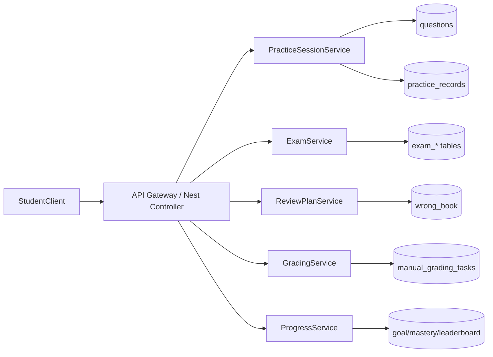
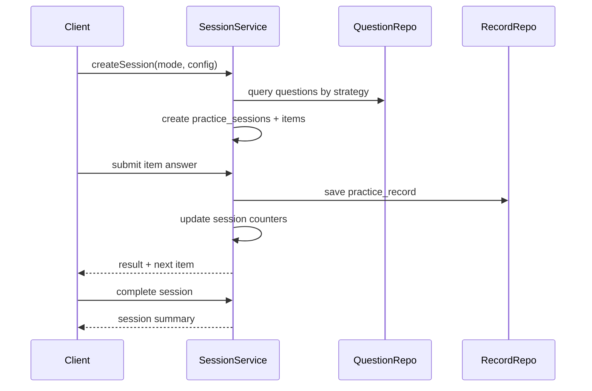

# 刷题系统增强技术方案与架构文档

## 1. 文档目的

定义刷题系统增强版本的技术落地方案，确保：

1. 与现有 `NestJS + TypeORM + PostgreSQL + React` 架构兼容。
2. P0/P1/P2/P3 功能按模块渐进交付。
3. 数据模型和接口具备可扩展性与可回滚性。

## 2. 现状基线

当前已存在核心模块：

1. 题库管理：`question-backend/src/modules/question`
2. 学生认证：`question-backend/src/modules/student-auth`
3. 学生刷题：`question-backend/src/modules/student-question`
4. 已有实体：
   - `practice_records`
   - `wrong_book`
   - `favorites`

结论：可在现有 `student-question` 能力上扩展，不需要重建基础题库链路。

## 3. 目标架构

## 3.1 逻辑分层

1. API层：Controller + DTO + Guard。
2. 领域层：Service + Domain Rule。
3. 数据层：TypeORM Repository + Migration。
4. 任务层：Scheduler/Queue（先DB+定时任务，后可切Redis队列）。
5. 观测层：日志、指标、告警、审计。

## 3.2 模块拆分（后端）

| 模块 | 说明 | 依赖 |
|---|---|---|
| `practice-session` | 会话创建、抽题、推进、结算 | question, student-question |
| `grading` | 主观题批改任务与批改结果 | practice-session, student |
| `review-plan` | 错题复习调度、到期队列 | wrong-book, practice-session |
| `exam` | 试卷、考试、交卷、报告 | question, grading |
| `progress` | 目标、打卡、掌握度、快照 | practice-records |
| `growth` | 排行榜、周报、消息中心 | progress, review-plan |

## 3.3 目标调用关系

## 4. 数据模型设计

## 4.1 新增实体

### 4.1.1 `practice_sessions`

| 字段 | 类型 | 说明 |
|---|---|---|
| id | uuid | 会话ID |
| student_id | uuid | 学生ID |
| mode | varchar(32) | `random/category/knowledge/review` |
| config | jsonb | 题量、筛选条件 |
| status | varchar(16) | `active/completed/abandoned` |
| total_count | int | 总题数 |
| answered_count | int | 已答题数 |
| correct_count | int | 正确题数 |
| started_at | timestamp | 开始时间 |
| ended_at | timestamp | 结束时间 |
| created_at | timestamp | 创建时间 |
| updated_at | timestamp | 更新时间 |

索引：
1. `(student_id, status, created_at desc)`
2. `(mode, created_at desc)`

### 4.1.2 `practice_session_items`

| 字段 | 类型 | 说明 |
|---|---|---|
| id | uuid | 会话题目项ID |
| session_id | uuid | 会话ID |
| question_id | uuid | 题目ID |
| seq | int | 顺序 |
| source_type | varchar(16) | `normal/review/recommend` |
| source_ref_id | uuid | 来源记录ID（如wrong_book_id） |
| status | varchar(16) | `pending/answered/skipped` |
| created_at | timestamp | 创建时间 |

唯一约束：
1. `(session_id, seq)`

### 4.1.3 `manual_grading_tasks`

| 字段 | 类型 | 说明 |
|---|---|---|
| id | uuid | 任务ID |
| record_id | uuid | 关联 `practice_records.id` |
| student_id | uuid | 学生ID |
| question_id | uuid | 题目ID |
| status | varchar(16) | `pending/assigned/done/reopen` |
| assignee_id | uuid | 批改人 |
| score | numeric(5,2) | 得分 |
| feedback | text | 评语 |
| tags | jsonb | 评语标签 |
| graded_at | timestamp | 批改时间 |
| created_at | timestamp | 创建时间 |
| updated_at | timestamp | 更新时间 |

索引：
1. `(status, created_at asc)`
2. `(assignee_id, status, updated_at desc)`

### 4.1.4 考试域表

1. `exam_papers`：试卷主表（标题、时长、总分、发布状态）。
2. `exam_paper_items`：试卷题目列表（题目ID、分值、顺序）。
3. `exam_attempts`：考试记录（学生、试卷、开始/结束时间、状态、总分）。
4. `exam_attempt_items`：考试单题作答结果（提交答案、得分、是否需人工批改）。

### 4.1.5 进度与增长域表

1. `learning_goals`：学生每日目标配置。
2. `student_daily_progress`：每日完成进度与打卡。
3. `student_mastery_snapshots`：知识点掌握度快照。
4. `leaderboard_scores`：榜单统计结果（天/周/月）。
5. `notification_messages`：站内消息。

## 4.2 现有表扩展

### 4.2.1 `practice_records` 扩展字段

| 字段 | 类型 | 说明 |
|---|---|---|
| session_id | uuid nullable | 关联练习会话 |
| session_item_id | uuid nullable | 关联会话题目项 |
| attempt_type | varchar(16) | `practice/review/exam` |
| score | numeric(5,2) nullable | 得分（用于主观题和考试） |
| graded_by | uuid nullable | 批改人 |
| graded_at | timestamp nullable | 批改完成时间 |
| grading_feedback | text nullable | 批改评语 |

### 4.2.2 `wrong_book` 扩展字段

| 字段 | 类型 | 说明 |
|---|---|---|
| review_level | int default 0 | 复习级别 |
| next_review_at | timestamp nullable | 下次复习时间 |
| last_review_result | varchar(16) nullable | `correct/wrong` |

## 5. 核心流程设计

## 5.1 练习会话流程

## 5.2 简答题批改流程

1. 提交简答题后，`practice_records.is_correct = null`。
2. 系统创建 `manual_grading_tasks` 任务。
3. 批改端领取任务并提交评分。
4. 回写 `practice_records` 与会话统计。
5. 发送批改完成消息给学生。

## 5.3 错题复习调度流程

1. 学生答错后进入或更新 `wrong_book`。
2. 根据规则计算 `next_review_at`。
3. 每日定时任务生成到期复习列表。
4. 学生开始“今日复习”会话。
5. 根据复习结果更新 `review_level` 与下次时间。

## 5.4 模拟考试流程

1. 学生开始考试，写入 `exam_attempts`。
2. 提交单题写入 `exam_attempt_items`。
3. 到时自动交卷。
4. 客观题自动判分，主观题流转批改任务。
5. 更新总分并生成考试报告。

## 6. API 设计（核心）

## 6.1 练习会话

1. `POST /student/practice-sessions`
2. `GET /student/practice-sessions/:id`
3. `GET /student/practice-sessions/:id/current`
4. `POST /student/practice-sessions/:id/items/:itemId/submit`
5. `POST /student/practice-sessions/:id/complete`
6. `GET /student/practice-sessions`

## 6.2 批改

1. `GET /grading/tasks`
2. `POST /grading/tasks/:id/claim`
3. `POST /grading/tasks/:id/submit`
4. `POST /grading/tasks/:id/reopen`

## 6.3 复习

1. `GET /student/review/today`
2. `POST /student/review/start`
3. `GET /student/review/history`

## 6.4 考试

1. `POST /exam/papers`（管理端）
2. `GET /exam/papers`
3. `POST /student/exams/:paperId/start`
4. `POST /student/exams/:attemptId/items/:itemId/submit`
5. `POST /student/exams/:attemptId/finish`
6. `GET /student/exams/:attemptId/report`

## 6.5 进度与增长

1. `GET /student/goals`
2. `PUT /student/goals`
3. `GET /student/mastery`
4. `GET /student/recommendations`
5. `GET /student/leaderboard`
6. `GET /student/notifications`
7. `POST /student/notifications/:id/read`

## 7. 架构决策

## 7.1 抽题策略

1. 第一阶段采用规则引擎（SQL过滤 + 随机抽样）。
2. 推荐策略先做可解释规则，后续演进到模型策略。

## 7.2 任务执行框架

1. 第一阶段：Nest Schedule + DB任务表。
2. 第二阶段：高并发场景可切换 Redis/BullMQ。

## 7.3 排行榜计算

1. 先采用离线批处理（小时级重算）。
2. 高并发阶段再引入实时增量更新。

## 8. 安全与权限

1. 所有学生端接口使用 `@UserType('student')`。
2. 批改、试卷管理接口使用 `@UserType('admin')` + `@Roles`.
3. 批改反馈、学习报告等敏感字段按权限分级返回。
4. 审计日志覆盖：批改、组卷、成绩修正、开关变更。

## 9. 可观测性设计

## 9.1 日志

日志字段统一：

1. `traceId`
2. `studentId`/`operatorId`
3. `module`
4. `action`
5. `latencyMs`
6. `result`

## 9.2 指标

1. 接口错误率、P95耗时。
2. 会话创建量、完成率。
3. 批改任务积压量、超时量。
4. 到期复习完成率。
5. 考试中断率、自动交卷率。

## 9.3 告警

| 告警项 | 阈值 |
|---|---|
| 提交接口错误率 | >2% 持续5分钟 |
| 批改待处理任务 | >500 |
| 复习调度失败任务 | >50/天 |
| 考试交卷失败 | >1% |

## 10. 测试策略

## 10.1 单元测试

覆盖以下核心逻辑：

1. 抽题策略。
2. 会话状态流转。
3. 复习间隔计算。
4. 批改回写逻辑。
5. 考试判分和总分计算。

## 10.2 集成测试

1. 会话创建到提交完整链路。
2. 简答题提交到批改完成链路。
3. 错题到期复习链路。
4. 考试开始到报告生成链路。

## 10.3 性能测试

重点压测：

1. `submit` 接口并发。
2. `review/today` 查询。
3. 考试交卷峰值。

## 11. 迁移与发布方案

## 11.1 迁移顺序

1. 创建新增表（`practice_sessions` 等）。
2. 给 `practice_records`、`wrong_book` 增加新字段。
3. 添加索引与约束。
4. 补历史数据默认值和回填脚本。

## 11.2 兼容性策略

1. 新字段均先允许 `nullable`。
2. 新接口灰度期间不影响旧接口。
3. 旧客户端仍可使用现有单题提交流程。

## 12. 后续演进方向

1. 引入队列系统优化批改和周报任务。
2. 引入 Redis 缓存排行榜与推荐结果。
3. 增加策略实验平台（A/B测试）。
4. 增加多端一致性同步策略（离线缓存+回传）。

